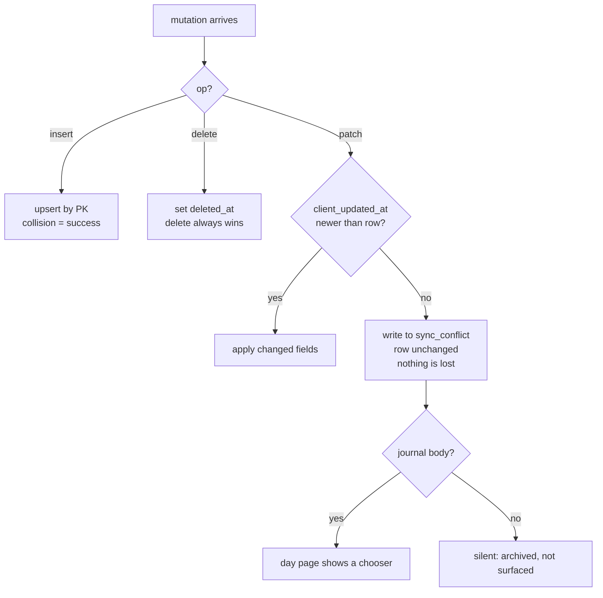

# 004 — Offline store, write queue and sync protocol

**Date:** 2026-08-28 · **Status:** accepted
**Implements:** D3, D22 · **Constrained by:** D15, D21
**Answers:** `ROADMAP.md` Part 4, `PLAN.md` §6.1, `coo -> architect` ask #2
**Normative protocol doc:** `docs/architecture/sync-protocol.md` (this ADR is the reasoning)

## Context

D3 makes offline logging a hard requirement. Phase 1's exit criterion is a write made in
airplane mode that syncs correctly. Nobody had designed the mechanism, and `coo` correctly
named it the project's top risk — a demo on Wi-Fi looks perfect right up until the boat
leaves the harbour.

D21's web prototype is a gift here, not a distraction. It forces the design now, months
before the Swift client exists, and it forces it to be a *protocol* rather than whatever
CoreData happens to make easy.

**The observation the whole design rests on:** the dominant write in this product is an
*insert* — a quick mark (D22), a trip start, a catch. Inserts do not conflict when the id
is generated on the device. Edits are rare, late, and almost always made on one device by
one person who is no longer fishing. This is not a collaborative document editor. Anything
that treats it like one is over-engineering, and over-engineering here has a cost measured
in a solo founder's weeks.

## The call

### 1. Local store

A local database on every client, holding the angler's own rows. Domain stores mirror the
schema — `trip`, `catch`, `trip_rig`, `journal_entry`, `condition_snapshot`, `spot`,
`tackle_item`, plus the reference vocabularies — with two extra stores, `outbox` and `meta`.

- **Web:** IndexedDB, via `idb` (a thin promise wrapper, ~1 kB). Not a sync framework.
- **Swift:** SQLite or CoreData. Its choice, its business.

Both sit behind one interface declared in `src/core/sync/store.ts`. The interface is part
of the protocol; the storage engine is not.

**Reads never touch the network.** Every screen renders from the local store. The network
fills the local store in the background. This is the rule that makes offline invisible
rather than a mode.

### 2. Ids: client-generated UUIDv7, always

Every row's primary key is a UUIDv7 minted on the device at the moment of the tap. Never a
server sequence, never a server round trip.

Three reasons, and each one alone would be sufficient:

1. **A write with no signal must succeed completely.** A row that needs the server for its
   own identity cannot be created offline, and everything that references it is stuck too.
2. **It is the idempotency key.** A retried insert collides on the primary key, and the
   server treats the collision as success. The whole retry story collapses into one line.
3. **UUIDv7 is time-ordered**, so it indexes without the random-UUID page-split penalty at
   100k rows, and it sorts by creation for free.

Swift can mint UUIDv7 in about fifteen lines. The generator is in `core/sync/` with vectors.

### 3. The outbox

An append-only local log. One record per mutation:

```
{ id            uuidv7          the mutation's own id
  entity        'catch' | 'trip' | 'journal_entry' | ...
  entity_id     uuidv7          the row it acts on
  op            'insert' | 'patch' | 'delete'
  payload       object          insert: the full row. patch: changed fields ONLY.
  client_updated_at  ISO8601    device clock. The conflict comparator.
  device_id     string          which device wrote it
  attempts      int
  last_error    string | null
  state         'queued' | 'sending' | 'done' | 'conflicted' | 'rejected' }
```

**Patches carry changed fields only.** Two devices editing different fields of the same
row therefore both survive, without per-field timestamps and without a CRDT. This is the
single highest-value cheap decision in the design.

**Flush** is sequential, in insertion order, over PostgREST via `supabase-js`. Sequential
ordering is what guarantees a trip exists before its catches — no dependency graph, no
topological sort, no batching RPC. Slower than a batch, and correct without any new
server code. A `sync_push` RPC that applies an ordered array in one transaction is the
obvious optimisation for the Watch on cellular; it is deliberately **not** V1.

Failure handling:
- Network error → leave `queued`, back off, retry. Not an error at the glass.
- 409 / PK collision on insert → `done`. Already landed.
- 4xx validation error → `rejected`, surfaced to the angler, never silently dropped.
- **Auth expiry** → refresh the session, then retry. If the refresh fails because there is
  no network, the mutation stays `queued`. A write is never lost because a token expired.
  This is the most commonly botched case in offline apps and it is the one that would
  destroy trust fastest.

Backoff: exponential with jitter, capped at 5 minutes. Flush is also triggered on the
`online` event, on visibility change, on app foreground, and on every new write.

### 4. Conflict policy



- **Inserts never conflict.** Client-generated ids, upsert semantics. This covers the
  overwhelming majority of writes, which is why the rest can be simple.
- **Patches: last-writer-wins per row, compared on the client clock**, not on server
  arrival. Comparing arrival time means the device that reconnects last wins even if it
  edited first, which is exactly backwards.
- **A losing patch is archived, never discarded.** It goes to `sync_conflict`
  (append-only, angler-owned, RLS). Nothing this app does silently destroys something an
  angler typed.
- **Deletes are soft** (`deleted_at`) and win against a concurrent patch. Tombstones sync
  like any other row. Hard deletion is a later purge job, if ever.
- **The journal is the one real conflict risk** — freeform text, one row per day, plausibly
  edited on a phone and a laptop. Policy: never merge, never silently overwrite. The loser
  lands in `sync_conflict` and the day page says *"another device saved a different version
  of this page"* with both texts and a choice. Rare enough to be worth doing properly.

**Clock skew.** `client_updated_at` is a device clock and a device clock can be wrong. We
accept it: the alternative is a server-issued Lamport counter that offline writes cannot
obtain. Mitigation is that the *server* clock owns `updated_at` (§5) so the sync cursor is
never skewed, and only the LWW comparison uses the device clock.

### 5. Pull

Server-authoritative `updated_at`, set by trigger on every syncable table. Never written
by a client — a client writes `client_updated_at`, which is a different column for a
different job. Conflating them breaks the cursor the first time a device clock is wrong.

Pull is `updated_at > cursor ORDER BY updated_at, id LIMIT n`, tombstones included,
cursor stored in `meta`.

**The bug everyone hits:** rows committed in one transaction share a timestamp, and a
strict `>` cursor can step over some of them. Mitigation: re-request from
`cursor - 2 seconds` every time, and rely on the local upsert being idempotent. A few
rows re-fetched is free; a permanently skipped catch is not.

### 6. What "synced" means at the glass

Three states, and the vocabulary matters more than the mechanism:

| state | says | shown as |
|---|---|---|
| local only, in outbox | **"Saved"** | nothing, or a small dot |
| on the server | **"Backed up"** | nothing |
| conflicted / rejected | needs the angler | the only state that interrupts |

Rules, non-negotiable:

- **A mark is saved the instant it is in IndexedDB.** No spinner, no "saving…", no
  disabled button. The man-overboard button (D22) never waits for a network.
- **Offline is a normal state, not an error.** No red banner. A quiet "3 waiting to back
  up" is the whole indicator. An angler on a boat is offline for six hours by design.
- **Never say "failed" while retries remain.** It has not failed; it is queued.
- **Nothing in the UI ever blocks on the network.** Enrichment arrives later and fills in;
  it does not hold up the save. `enrichment_status = 'pending'` is the normal path.

### 7. Next.js specifics, and one warning

Read `node_modules/next/dist/docs/01-app/02-guides/offline-support.md` before touching this.

`experimental.useOffline` keeps failed navigations, RSC fetches and Server Actions pending
and retries them when connectivity returns, and the `useOffline()` hook from `next/offline`
drives an honest banner. Both are worth having, for **navigation and reads**.

**The warning, and it is the sentence to remember from this ADR: `useOffline` is not a
write queue.** Its pending request lives in the tab. A reload, a crash, a phone locking and
the tab being evicted, and the write is gone. Durability is the outbox's job and only the
outbox's job. Per ADR 003 §5 our writes do not go through Server Actions at all.

For a cold load with no network, a service worker precaching the app shell for `/` and
`/day/[date]` is required — the Next docs are explicit that `useOffline` does not cover it.
Small, and worth it for a prototype whose whole purpose is being opened on a boat.

**Say it plainly:** iOS Safari does not support Background Sync, so a web outbox flushes
only while a tab is open. A phone in a pocket for four hours syncs nothing until the angler
looks at it. That is acceptable for a prototype — the data is safe locally the whole time —
and it is one more concrete argument for D15's native client, which can flush in the
background.

### 8. How Swift adopts this

Nothing above is web-specific. `docs/architecture/sync-protocol.md` is normative and
language-neutral: the envelope, the id rule, the flush order, the conflict table, the
cursor overlap, the state vocabulary. Swift implements the same `store` interface over
SQLite, the same outbox, the same UUIDv7 generator (against the same vectors), and talks to
the same PostgREST endpoints. The Watch queues into the phone's outbox over
WatchConnectivity rather than owning its own server session.

## What it costs us

- **Every row exists twice**, locally and on the server, and something has to reconcile
  them. That is inherent to offline-first, not to this design.
- **Row-level LWW loses same-field concurrent edits** — the loser is archived, not merged.
  Correct for a single-angler product; wrong for a shared boat log, which we are not
  building.
- **Client clocks are trusted** for conflict ordering. Bounded, and stated above.
- **Sequential flush is slow** on a large queue. A hundred queued marks is a hundred round
  trips. Fine at V1 volumes; `sync_push` exists as the answer when it stops being fine.
- **A hand-rolled sync layer is code we own forever**, including the bugs. Roughly 300–400
  lines per client, and it is the kind of code that is subtly wrong in ways tests do not
  catch. Mitigation: the protocol doc, the vectors, and an airplane-mode test in the phase
  exit criteria rather than a Wi-Fi demo.
- **The web prototype will not background-sync on iOS.** Above.

## Rejected

- **PowerSync / ElectricSQL / Replicache.** Real engineering, genuinely better conflict
  handling, and PowerSync even has a Swift SDK. Rejected for V1 because each adds a hosted
  service or a replication component to a stack currently consisting of "Supabase", and
  because the dominant write is a conflict-free insert. Revisit the day multi-device edit
  conflicts become a real complaint rather than a hypothetical.
- **CRDTs.** The correct answer to a problem we do not have. One angler, one fish, one row.
- **Server-generated ids.** Would make offline creation impossible and idempotent retry
  hard. Not a close call.
- **Full-row patches.** Simpler to implement and they clobber concurrent edits to unrelated
  fields. Changed-fields-only costs almost nothing and removes most conflicts outright.
- **Discarding a losing patch.** One line cheaper and it silently destroys something a
  person wrote. `sync_conflict` is the price of being able to say we never lose data.
- **Server Actions plus `experimental.useOffline` as the write path.** Ergonomic, Next-idiomatic,
  not durable across a reload, and unavailable to Swift. §7 and ADR 003 §5.
- **WatchConnectivity direct-to-server from the Watch.** Two independent outboxes for one
  angler, and the Watch has the worse network. The phone owns the queue.
