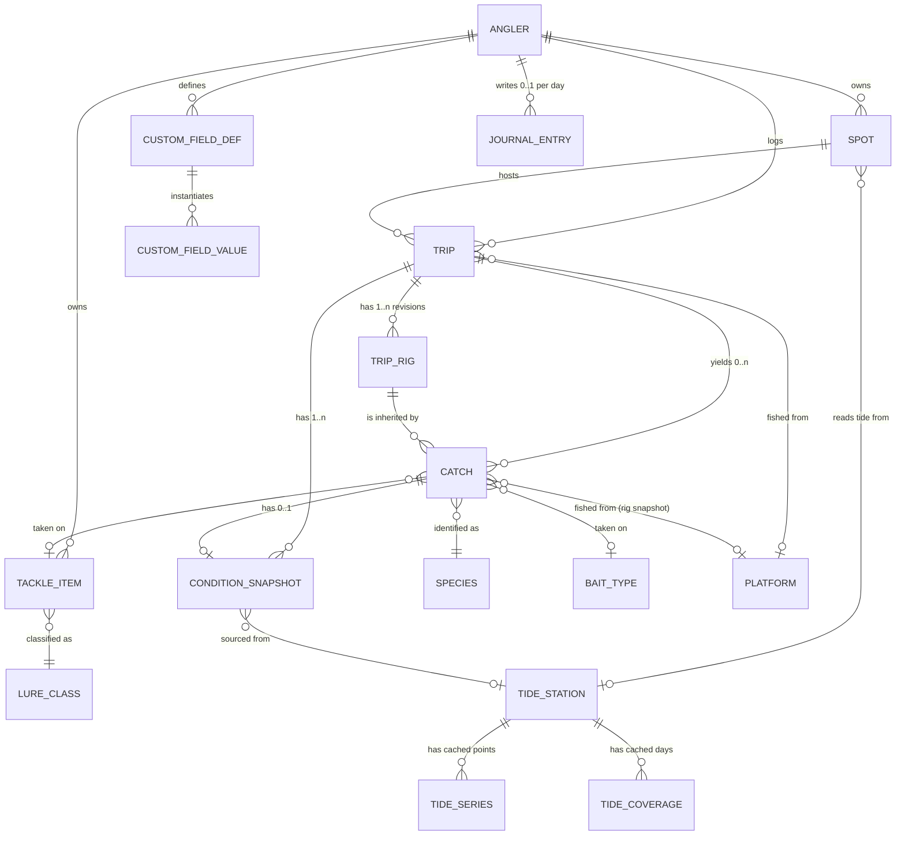
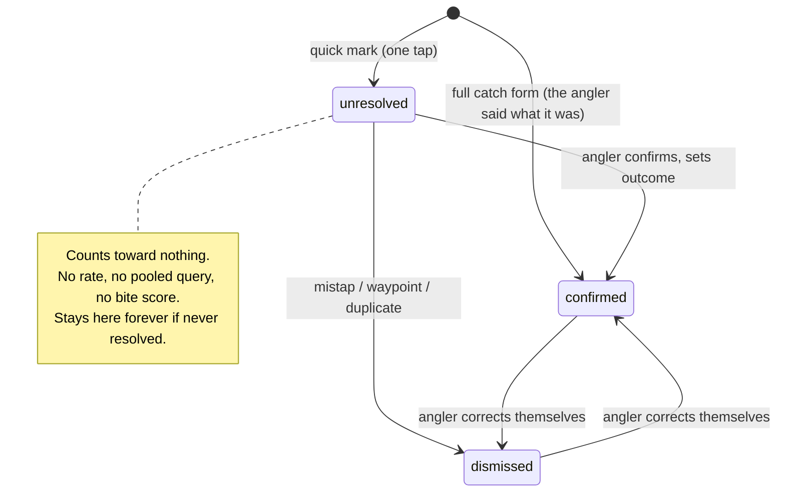

# Canonical Ontology

**Status:** draft. Resolves O5; implements D11, D13, D18, D20, D21a, D22, D23, D24.
**Owner:** `architect`. Corrections to the vocabularies belong to the founder.
Built as SQL in `supabase/migrations/` (ADR 003). Species and tackle lists still need the
founder’s red pen — the seed marks every guess `needs_review = true`.

## How to read this

| Mark | Meaning |
|---|---|
| `AUTO` | Phone or API supplies it. The user never sees an empty box (D9). |
| `USER` | The user types or taps it. The data to auto-fill it does not exist. |
| `DERIV` | Computed from other stored fields. Never typed, never fetched. |
| `?` | **I am guessing at angler vocabulary here.** Founder must correct. |

`?` is not decoration. Where it appears I have invented a term or a boundary from
outside the sport and it is likely wrong.

## 1. The shape of the model

Six things hang together and the rest is vocabulary:

- **Trip is the unit of effort.** It is the denominator (D2). A Trip with zero Catches
  is not an empty record — it is the most valuable record in the database.
- **Catch always belongs to a Trip.** No orphans, ever. If a user one-taps a catch
  without having started a trip, the app opens an implicit Trip behind them. A Catch
  with a null `trip_id` would silently vanish from every rate calculation.
- **ConditionSnapshot is immutable and repeatable.** It is not a column set on Catch.
  A Trip gets one at start, one at end, and one per Catch. That is how "conditions when
  it happened" differs from "conditions when nothing happened" within the same trip.
- **Spot is a place; a Trip references it.** Coordinates on the Catch are the truth of
  where the fish came from; the Spot is the user's name for the neighbourhood.
- **Species, LureClass, BaitType, StructureType** etc. are global reference tables, not
  enums in code — rows get added without a deploy, and they carry `water_class` scoping.
  D15 makes this load-bearing: with Swift, a later Kotlin client and the server in play,
  a compiled enum guarantees three clients that disagree about what "jerkbait" means.
  Vocabularies ship from the database with a version stamp, cached on device. Same
  reason: keep client-side derivations arithmetic — logic written three times must be
  too simple to drift.
- **CustomField\* is a separate, physically isolated island.** §5.
- **JournalEntry hangs off the angler and a date, not off a Trip.** The calendar is the
  history surface (D23) and a day is writable whether or not anybody went fishing. §2.1.
- **TripRig is append-only.** A rig revision is a fact about a moment, and a Catch that
  inherited it keeps a copy plus a pointer. Editing the rig cannot rewrite history. §2.3.

### Blank trips, and the honesty problem underneath them

There is no `is_blank` column. Blank is `count(catches) = 0`, `DERIV`, always — a
stored flag drifts the first time a catch is deleted. But R2 is real: a Trip with zero
catches might mean "caught nothing" or "the user stopped logging halfway through", and
those must not look the same to the analysis. So Trip carries:

- `ended_at` `USER` — nullable. Null means the trip was never closed out.
- `zero_catch_confirmed_at` `USER` — set only when the user answers "caught nothing"
  on the end-of-trip prompt.
- `catch_log_confidence` `USER` — `complete` / `partial` / `unknown`. Default `unknown`
  on an abandoned trip, `complete` when the trip was closed properly.

**Rule for the analysis layer:** only trips with `catch_log_confidence = 'complete'`
count toward a denominator. Everything else is logged, kept, and excluded from rates.
This is the difference between a real catch rate and a flattering one.

## 2. Core entities

### Angler
Thin wrapper over Supabase `auth.users`: unit preference (imperial/metric), home water
class, nothing else. No display name — there are no social features (spec §6), so there
is nobody to display it to.

### Spot
| field | mark | notes |
|---|---|---|
| `name` | USER | "The corner", "Second jetty". Private. Treat as sensitive text (§6). |
| `water_class` | USER | `salt` \| `fresh`. **This one field switches ontologies.** |
| `water_body_type` | USER | surf / pier / jetty / harbor / bay / open_coast / island / lake / reservoir / river / pond `?` |
| `lat`, `lng` | AUTO | From map tap (D4) or first catch. Precision policy in §6. |
| `geo_cell_1km`, `geo_cell_10km` | DERIV | Generated. The only geography that leaves the user's rows. |
| `tide_station_id` | DERIV | Nearest *reference* station, resolved once and pinned. |
| `weather_station_id`, `buoy_id` | DERIV | Same, with distance stored. |
| `alongshore_bearing_deg` | USER | 0–359. The compass bearing of *up-coast* from this spot — what the angler calls "uphill". Salt only. §3.1 |
| `offshore_bearing_deg` | USER | 0–359. The bearing of *away from land*. Salt only. §3.1 |
| `axis_source` | AUTO | `user_drawn` \| `coastline_prefill` \| `unset`. Provenance for the two bearings above. |
| `axis_revision` | AUTO | Bumped whenever either bearing is edited. §3.1 explains why this matters. |

Pinning the station on the Spot rather than resolving per-catch matters: a spot whose
station silently changes has an incoherent history.

### Trip
| field | mark | notes |
|---|---|---|
| `spot_id` | USER | Nullable — a boat trip may roam. Catches still carry coordinates. |
| `water_class` | DERIV | Denormalised from Spot. Every pooled query filters on it first. |
| `started_at`, `ended_at` | AUTO/USER | Start is auto on tap; end is user. Both UTC + IANA tz. |
| `platform` | USER | shore / surf / pier / jetty / kayak / private_boat / party_boat / float_tube / belly_boat. **D26, settled.** A vocabulary table, FK-constrained on trip, rig and catch. Nullable in the column, required by the UI. |
| `angler_count` | USER | Defaults 1. Effort scales with it. |
| `target_species_ids[]` | USER | What they went for, not what they got. Cheap, and it makes a blank trip interpretable. |
| `hours_fished` | DERIV | From start/end. Not typed. |
| `zero_catch_confirmed_at`, `catch_log_confidence` | USER | Above. |
| `notes` | USER | Free text about *this trip*. Never parsed for statistics. Distinct from the day journal — §2.1. |
| `local_date` | DERIV | The calendar day this trip belongs to. Trigger-set, not generated. §2.1 |
| `started_tz`, `ended_tz` | AUTO | IANA zone captured from the device at each end. |
| `capture_mode` | AUTO | `live` \| `backfill`. Immutable after insert. §2.4 |
| `client_created_at` | AUTO | Device clock at the moment the row was created. §2.4 |

`platform` is the highest-value stratifier in the model and costs one tap. Surf catch
rates and party-boat catch rates are not the same population and must never be pooled.
D26 settled it on 2026-08-28; it is no longer a proposal. It lives in `public.platform`
with a `label`, a `sort_order` and an `is_vessel` rollup for when one platform has too
few trips to stand alone. ADR 005.

### Catch
| field | mark | notes |
|---|---|---|
| `trip_id` | AUTO | Mandatory. |
| `caught_at` | AUTO | Device clock, UTC, plus captured IANA timezone. |
| `lat`, `lng`, `gps_accuracy_m` | AUTO | Correctable by map tap (D4). Store the accuracy — a 60 m fix is a different fact from a 4 m fix. |
| `species_id` | USER | Nullable. "Needs details" queue exists precisely so this can be filled later. |
| `outcome` | USER | `landed` \| `lost` \| `missed_bite` \| `short_bite`. **Settled** (blessed proceed-don't-wait, 2026-08-28). A lost fish is a bite, and bites are the signal. A `confirmed` mark must have one — it is the field that makes a row countable. |
| `disposition` | USER | `released` \| `kept` \| `n/a`. |
| `length_mm`, `weight_g` | USER | SI in the column, imperial at the glass. `size_estimated` boolean beside them. |
| `tackle_item_id` | USER | The user's own lure (§4). |
| `bait_type_id` | USER | Nullable, and orthogonal to lure — bait on a jighead is both. |
| `presentation` | USER | slow_roll / dead_stick / yo_yo / burn / bounce / drift / dropper_loop / fly_swing `?` |
| `depth_fished_m` | USER | Where the lure was, not where the bottom was. |
| `bottom_depth_m` | USER | Nullable. No API gives this at a useful resolution. |
| `structure_type_id`, `cover_type_id` | USER | §7. Both nullable, both settable. |
| `photo_id` | USER | V2. EXIF stripped on ingest (§6). |
| `notes` | USER | Short, about this fish. Not the day journal. |
| `resolution_state` | USER | `unresolved` \| `confirmed` \| `dismissed`. A quick mark starts `unresolved`. §2.2 |
| `dismissed_reason` | USER | `mistap` \| `not_a_fish_waypoint` \| `duplicate`. Null unless dismissed. |
| `resolved_at`, `resolved_by` | AUTO | When and by whom. Only a human moves this. §2.2 |
| `resolution_source` | AUTO | `live` \| `needs_details_queue` \| `backfill_edit`. How the resolution was made. |
| `spot_id` | USER | Nullable. Inherited from the rig. A roaming trip changes spot mid-trip; the Spot's D20 axes resolve per-catch. |
| `platform` | USER | Nullable, FK to `platform` (D26). Inherited from the rig; falls back to `trip.platform` in the client. Surf then jetty in one trip is one trip. |
| `rig_id`, `rig_revision` | AUTO | Which rig revision this mark inherited. §2.3 |
| `inherited_fields` | AUTO | `text[]` — which of the above the rig supplied rather than the angler typing. §2.3 |
| `capture_mode` | AUTO | `live` \| `backfill`. Immutable after insert. §2.4 |
| `client_created_at` | AUTO | Device clock at the tap. §2.4 |

### ConditionSnapshot
One row per moment we care about. `kind` = `trip_start` \| `trip_end` \| `catch` \|
`manual` \| `interval`. Holds `trip_id NOT NULL` and `catch_id NULL` — a real foreign key
each way, no polymorphic column. Also denormalises `water_class` so that "tide is null
because this is a lake" and "tide is null because the fetch failed" are distinguishable.
Fields are grouped in §3. Two columns that must exist from day one:

- `enrichment_status` — `pending` \| `complete` \| `partial` \| `failed` \| `unavailable`.
  Offline logging (D3) means the snapshot is written before the APIs are reachable. This
  is not an edge case; it is the normal path. `failed` is transient and gets retried.
  **`unavailable` is terminal**: no source covers this place and date, the fields stay
  null forever, and the retry job must stop asking. D24's backfill makes this a routine
  outcome rather than a rarity — see §2.4.
- `snapshot_basis` — `observed` \| `historical_reconstruction`. Whether the numbers were
  captured near the moment or reassembled from an archive afterwards. §2.4.
- `provenance` jsonb, keyed by field name: `{source, station_id, distance_m, fetched_at}`.
  Biostat's rule 2. A water temp from 100 km away is a different fact from one at the
  pier and the UI has to be able to say which it has.
- `algo_version` int — which version of the tide/moon maths produced the `DERIV` fields.
  We will change that maths, and without this we cannot tell recomputed rows apart.

**Missing is null. Never zero.** (biostat rule 1.)

### JournalEntry (D23)
| field | mark | notes |
|---|---|---|
| `angler_id` | AUTO | |
| `entry_date` | USER | A `date`, not a timestamp. **Identity**, with `angler_id`. §2.1 |
| `entry_tz` | AUTO | IANA zone the device was in when the page was first written. Provenance, *not* part of the key. |
| `body` | USER | Freeform. Never parsed for statistics, never pooled. §2.1 |
| `capture_mode` | AUTO | `live` \| `backfill`. §2.4 |
| `client_updated_at`, `updated_at` | AUTO | Device clock and server clock. Both, for sync. ADR 004 |

`unique (angler_id, entry_date)`. No foreign key to Trip in either direction.

### TripRig (D21a)
| field | mark | notes |
|---|---|---|
| `trip_id`, `revision` | AUTO | `unique (trip_id, revision)`. Revision starts at 1 and only goes up. |
| `effective_from` | AUTO | When this revision became the standing rig. |
| `spot_id`, `platform`, `tackle_item_id`, `bait_type_id`, `depth_fished_m` | USER | The sticky values. All nullable — a half-set rig is normal. |
| `target_species_ids[]` | USER | Intent. Not copied onto each Catch; the pointer covers it. §2.3 |

**Append-only.** `UPDATE` and `DELETE` are not granted on this table. Changing the rig
means inserting revision *n+1*. §2.3 explains why that is the whole mechanism.

### 2.1 The calendar day is a local date, not an instant (D23)

The app opens onto a month grid, so the model needs a thing that is exactly one cell. An
instant is not that: `2026-08-28T07:00Z` is one date in San Diego and another in Auckland,
and an angler who flies to Cabo does not want two August 28ths.

**The call.** A journal entry is keyed `(angler_id, entry_date)` where `entry_date` is a
plain `date`. The zone the angler was standing in is stored beside it as `entry_tz`, as
provenance, and is deliberately **not** part of the key. One calendar, one cell per day,
forever. If the angler crosses a date line mid-trip they get one page for the 28th and one
for the 29th; both are writable, nothing is lost and nothing is duplicated.

**Which day a Trip belongs to.** `trip.local_date = (started_at AT TIME ZONE started_tz)::date`.
A trip that starts at 22:00 and lands a halibut at 01:30 is **one trip, on the day it
started**. One rule, applied everywhere, no exception for night fishing. It is wrong some
of the time and legible all of the time, which beats a rule nobody can predict.

`AT TIME ZONE <text>` is STABLE, not IMMUTABLE — it reads the tz database, and that gets
updated. So `local_date` cannot be a generated column; a `BEFORE INSERT OR UPDATE` trigger
sets it. Same for `catch.local_date`. Worth knowing before someone spends an afternoon on it.

**A Catch also carries its own `local_date`,** and it can differ from its trip's. The day
page groups catches under their **trip**, so the 01:30 halibut appears on the 28th with the
rest of its trip. Date-range *queries* use the catch's own `local_date`. Both are true
answers to different questions; storing both is cheaper than arguing about it.

**Cardinality.** A day has zero, one, or many trips. A day has zero or one journal entry. A
journal entry needs no trip and a trip needs no journal entry. The day page is a *view* over
three independent things — journal, trips, catches — that happen to share a date.

**What happens to `Trip.notes`.** It stays, unchanged, and is not migrated. Trip notes and
the day journal answer different questions: "the wind switched at three and it died" belongs
to the trip; "first time out since the shoulder" belongs to the day. Two text boxes on one
screen is a bad screen, so the *UI* resolves it — the day page shows only the journal, and
trip notes live inside the trip detail view. If a season of real use shows nobody fills
both, a later ADR deprecates one. We do not drop a text column on a hunch.

**Journal text is never analysed.** Not sentiment, not keywords, not "we noticed you wrote
'red tide'." Enforced the way §5 enforces custom fields — the pooled-analysis role holds no
grant on the table at all (§5.1). If something in the prose matters it graduates into a
canonical field, by ADR and migration, like any other promotion.

### 2.2 The mark resolution lifecycle (D22)

A quick mark is a man-overboard button: one tap, position saved, no questions. That speed is
bought by writing a row that is *not yet a fact*. The lifecycle is what stops the speed from
contaminating the statistics.

Three states and nothing else. `landed` vs `lost` vs `missed_bite` is `outcome`, not a
resolution state — "it was a fish and I lost it" is a **confirmed** mark. A dismissal
carries a reason: `mistap`, `not_a_fish_waypoint`, `duplicate`. A waypoint is kept, with its
coordinates, because a saved position is useful; it simply is not a fish.

**Only a human moves a mark.** No job auto-confirms, no age threshold auto-dismisses, no
model guesses. A 2023 mark still sitting at `unresolved` is excluded from every rate in
2027, and that is correct — nobody ever established that it happened. `resolved_at`,
`resolved_by` and `resolution_source` record the act.

**Confirming means saying what happened:** a `confirmed` row must have a non-null `outcome`
(CHECK constraint). Species may stay null — "a fish, no idea what" is honest, and the
needs-details queue exists for exactly that. Outcome is the field that makes it countable.

**The exclusion is structural, not a rule to remember.** Following §5's principle:

- Nothing that computes a rate reads the `catch` table. The app reads
  `public.catch_countable` — a `security_invoker` view, RLS intact, filtered to
  `resolution_state = 'confirmed' AND deleted_at IS NULL`. Pooled analysis reads
  `analytics.catch_event`, under a role with **no grant on `public.catch` at all** (§5.1).
- A trigger enforces the state machine. Nothing returns to `unresolved` once resolved.
- **A trip holding an unresolved mark is not a valid denominator either.** Its numerator is
  unknown, so `analytics.trip_effort` excludes it alongside the `catch_log_confidence`
  filter. This is the strict reading and it is deliberate: it turns "resolve your marks"
  from a nag into the thing that makes your own numbers appear. **D27 settled this on
  2026-08-28 and confirmed the strict form** — the whole trip, not merely the mark. It is
  no longer "one line to soften"; softening it now needs a new decision.

  *The cost, stated and accepted:* one forgotten tap silently withholds an entire trip.
  D27 accepts that **only on the condition that the exclusion is visible and fixable**.
  Unresolved marks surface at End Trip and carry the calendar's amber flag
  (`docs/product/ux-calendar-notebook.md`, `ux-ui`'s design, already done). A muted trip
  must never be a silent hole. **That UI is a dependency of this rule, not a nicety** — if
  the surfacing is ever dropped, the exclusion has to be revisited in the same breath. If
  marks go unresolved in the field anyway, the answer is better prompting, not a looser
  rule.

### 2.3 The sticky rig (D21a)

Set spot, platform, lure, bait, depth and target once; every subsequent mark inherits it.
The only hard requirement is that changing the rig at 3pm must not retroactively change what
the 11am fish was caught on.

**Two mechanisms, both required:**

1. **`trip_rig` is append-only.** Editing the rig inserts revision *n+1* with a new
   `effective_from`. `UPDATE`/`DELETE` are not granted to `authenticated`, so history cannot
   be rewritten even by a buggy client. Revision *n* stays a permanent record of what the
   angler had on at that hour.
2. **Each Catch copies the hot fields at insert.** `spot_id`, `platform`, `tackle_item_id`,
   `bait_type_id` and `depth_fished_m` are written onto the Catch row from the standing rig,
   along with `rig_id`, `rig_revision`, and `inherited_fields text[]` recording which of them
   came from the rig rather than from the angler's thumb.

Why both. The copy is what queries filter on — "every fish on a chartreuse swimbait" has to
be an index scan on `catch`, not a temporal join across rig revisions at 100k rows. The
pointer preserves everything *not* copied (`target_species_ids`, and whatever the rig grows
later) without denormalising an array onto every mark.

`inherited_fields` earns its place twice. The UI can honestly label a value "from your rig"
rather than implying the angler asserted it, and analysis can tell an inherited depth from a
measured one. An inherited value is a weaker claim than a typed one.

**Editing an inherited field on one mark** removes that field name from `inherited_fields`
and leaves the rig alone. Editing the rig affects marks taken after `effective_from` and
nothing before it. There is no "apply to previous catches" button and there should not be one.

### 2.4 Live versus backfilled, and where the conditions come from (D24)

Any past day is writable, so paper logs can be typed in. A row the app witnessed and a row
recalled at a kitchen table are different evidence and must stay distinguishable forever.

**On every angler-authored row** (`trip`, `catch`, `journal_entry`):

| column | meaning |
|---|---|
| `capture_mode` | `live` \| `backfill`. Asserted by the client at insert. **Immutable** — a trigger rejects any UPDATE that changes it. |
| `client_created_at` | Device clock at the moment of creation. |
| `created_at` | Server clock at the moment the row landed. |

`capture_mode` cannot be derived from the clocks, and code that tries is a bug: offline (D3)
means a genuinely live mark can reach the server six hours later, and D24 means a backfilled
row can be typed the same evening. The client asserts it; the database pins it. A CHECK
constrains the assertion — a `live` row requires `client_created_at`, and its event time must
fall between `client_created_at - 18 hours` and `client_created_at + 5 minutes`. Logging from
the truck at the end of a session is still live; typing in last April is not.

The window was 12 hours until 2026-08-28 and 12 was wrong for this fishery: a full-day SoCal
party boat runs 12–14 hours, and logging the whole session in the car park afterwards is the
normal case, not the edge. Under 12h the hour-one fish was rejected, which pushed the client
into calling a witnessed row `backfill` — the exact lie the column exists to prevent. 18h
covers a full-day boat plus the drive home and still puts a kitchen table the next morning
outside. ADR 007.

**Conditions for a backfilled day.** `condition_snapshot.snapshot_basis =
'historical_reconstruction'`, and the source ladder is:

| age of the day | source | notes |
|---|---|---|
| now → ~2 days | NWS `api.weather.gov` | the live path; `snapshot_basis = 'observed'` |
| older | NOAA NCEI (LCD / ISD) | archive; lags roughly 1–3 days behind real time |
| tide, any age | NOAA CO-OPS predictions | predictions are computed, so past dates are as available as future ones |
| moon, sun | computed on device | no API, no age limit, always available |
| nothing covers it | **null** | `enrichment_status = 'unavailable'`, terminal |

There is a real gap between NWS's ~2-day horizon and NCEI's ingest lag — a day can be too old
for one and too new for the other. That resolves itself within days, so those snapshots stay
`pending` and get retried rather than being written off as `unavailable`.

**Missing stays null. Never zero.** (biostat rule 1, and it is under the most pressure right
here — an archive gap is far more common than a live fetch failure.) `provenance` gains
`backfill: true` and `lag_days` per field, so a water temperature reconstructed 400 days
later is visibly a different fact from one read off a pier.

**For analysis:** `capture_mode` is a NOT NULL column on `analytics.catch_event` and
`analytics.trip_effort`. Base tables are not granted, so there is no way to pull a pooled
dataset without the column in front of you. Whether to stratify on it is `biostat`'s call,
not the schema's — but the schema makes ignoring it a decision rather than an oversight.

## 3. Two vocabularies, one engine (D13)

Divergence between salt and bass is **field nullability and vocabulary scope**, not
table structure. One `condition_snapshot` table serves both.

### Shared by both — the automatic set
| field | mark |
|---|---|
| `pressure_hpa`, `pressure_trend_3h_hpa` | AUTO — device barometer at log time, API backfill otherwise |
| `air_temp_c`, `wind_speed_ms`, `wind_dir_deg`, `cloud_cover_pct` | AUTO |
| `moon_phase_angle_deg` | AUTO — correlate on this, **not** illumination |
| `moon_illumination_fraction` | AUTO — display only |
| `days_from_full`, `days_from_new` | DERIV — **signed** |
| `moonrise_utc`, `moonset_utc`, `sunrise_utc`, `sunset_utc`, `civil_twilight_*` | AUTO |
| `minutes_from_sunrise`, `minutes_from_sunset` | DERIV — signed. Cheap, and probably one of the strongest predictors in the set |
| `day_of_year` | DERIV |

The 8-phase moon label is **never stored and never analysed on** — derived at render
time, for the icon only.

### Shared, but user-entered
| field | mark |
|---|---|
| `water_temp_c` | USER — D8, O3. Nearest buoy shown as a labelled reference beside an empty field. Never prefilled. |
| `surface_condition` | USER — glassy / ripple / light_chop / chop / whitecaps `?` |
| `bait_present` | USER — none / scattered / balls / heavy `?` Big signal in SoCal, one tap. |
| `bird_activity` | USER — none / scattered / working `?` |

### Salt only — null on a lake, and null *means* not applicable
| field | mark |
|---|---|
| `tide_height_m` | AUTO — NOAA CO-OPS 6-minute predictions |
| `tide_rate_m_per_hr` | AUTO — differenced series (O1). Signed: + flood, − ebb |
| `tide_state` | DERIV — `flood` \| `ebb` \| `slack` from the sign and magnitude of the rate |
| `tide_pct_through_cycle` | DERIV — 0–100 |
| `twelfths_hour` | DERIV — presentation over the real curve, never the maths underneath |
| `tide_range_m` | DERIV — the day's high minus low. "Big tide" lives here |
| `current_term` | **USER** — D10/D20. uphill / downhill / inshore / offshore. The angler's raw assertion |
| `current_bearing_deg` | DERIV — the physical direction, from `current_term` + the Spot's two axes. §3.1 |
| `current_axis_revision` | DERIV — which revision of the Spot's axes produced the bearing |
| `current_strength` | USER — none / light / moderate / ripping `?` |
| `swell_height_m`, `swell_period_s`, `swell_dir_deg` | AUTO where a buoy is in range, else null |

Never call `tide_rate_m_per_hr` "current" in schema, API, or copy (R7) — hence the
column name.

### 3.1 Current direction: words on top, bearing underneath (D20)

Settled: two perpendicular axes, four terms. **Uphill** is the current running up-coast —
northwest here, toward Long Beach and Santa Barbara. **Downhill** is down-coast, toward
Dana Point and San Diego. **Inshore** is toward the beach, **offshore** away from it.
Anchored to the coastline, **not to the tide**: a flooding tide can run either way along
the coast, so `current_term` and `tide_state` are independent variables. Nothing here is
derivable from tide phase, and code that tries is a bug.

The angler only ever sees and taps their own four words. Underneath:

| where | column | why |
|---|---|---|
| Spot | `alongshore_bearing_deg` | bearing of "uphill" here. USER |
| Spot | `offshore_bearing_deg` | bearing of "away from land". Two explicit bearings, not one plus a rule — one bearing leaves offshore ambiguous between two perpendiculars, and a jetty corner need not be exactly 90°. Do not constrain them perpendicular |
| Spot | `axis_source`, `axis_revision` | provenance, and a bump on every edit |
| Snapshot | `current_term` | the raw datum: what the angler asserted |
| Snapshot | `current_bearing_deg` | DERIV from term + the Spot's axes. What analysis pools on |
| Snapshot | `current_axis_revision` | detects a bearing computed from superseded geometry |

Both are stored, deliberately. Only the bearing, and a spot whose axes were set wrong can
never be corrected — you cannot recover "they said uphill" from a wrong number. Only the
term, and nothing pools across spots or coastlines. Derivation is a lookup plus one
mod-360 add (`downhill = alongshore + 180`), trivial by design because under D15 it gets
written in Swift, in Kotlin and on the server.

**Where the axes come from.** Asked once per Spot, ever: the map shows a two-headed arrow
the user drags along the beach, then taps the water side. Two gestures. Prefilling from a
coastline dataset is a possible later improvement, not a plan — NOAA CUSP, Natural Earth
and GSHHG are all *unverified* here for resolution, licence and size, and Natural Earth
is almost certainly too coarse for a jetty. Somebody verifies before anybody designs
against it. Unlike water temperature (O3), a confirmed prefill here would be legitimate:
a coastline bearing is a static geometric fact, not a measurement.

**No spot, no bearing.** A roaming boat trip may have `trip.spot_id = null`. Record
`current_term` anyway, leave `current_bearing_deg` null, and report it as unresolved.
Inventing an axis for a catch two miles out would be fabrication.

Reasoning, alternatives and costs: `decisions/002-current-direction-storage.md`.

### Fresh/bass only — absent on the coast
| field | mark |
|---|---|
| `water_clarity_id` | USER — §7 |
| `water_color_id` | USER — §7. Distinct from clarity: brown-and-clear is not green-and-clear |
| `visibility_cm` | USER — optional numeric beside the categorical |
| `water_level_trend` | USER — rising / stable / falling `?` (auto only for ~30 CA waters, per biostat §6) |
| `lake_elevation_m` | AUTO where USGS covers the water, null otherwise |
| `seasonal_pattern_id` | USER — §7. The bass-angler frame that has no saltwater equivalent |

**Freshwater has no current-direction fields at all** — not nullable ones. A lake has no
coastline axis and no along-shore current, so `current_term`, `current_bearing_deg` and
the Spot's two bearings are absent for `water_class = 'fresh'`, exactly as tide is. A
meaningless nullable column gets filled in by somebody eventually.

D18 makes this live rather than theoretical. **Open question for the founder:** dam
tailrace and creek-inflow current genuinely matters to bass anglers, and I do not know
whether it belongs in V1. If it does, it is a *different* field with a different
vocabulary — not a reuse of the coastline four. Reusing these terms inland is the exact
mistake D13 exists to prevent.

### The trap in the nullable approach

Nullable-everywhere makes "not applicable" and "we failed to fetch it" identical. Two
mitigations, both required: `water_class` is denormalised onto the snapshot so
not-applicable is derivable without a join (no `not_applicable` sentinel — a sentinel is
a value, and values get averaged by accident), and `enrichment_status` distinguishes
fetch failure from absence. Analysis always filters `water_class` first — no query
meaningfully pools a lake and an ocean, and the schema should make that awkward.

## 4. Tackle: the two-level move

The single most important structural idea for keeping data poolable. A user's lure is "Lucky Craft 110 in chartreuse shad, the one with the beat-up hooks".
That string is worthless across users. The *class* — jerkbait — is worth a lot.

- `tackle_item` — user-owned, free text, colour, size, whatever they want. Powers the
  favourite-lures list (V1) and their own filtering. **Not poolable.**
- `lure_class` — global controlled vocabulary. Every `tackle_item` must point at one.

The user names their lure once; every catch after that inherits a poolable class for
free. They never type a taxonomy and we never lose one. Same pattern applies wherever
users have idiosyncratic names for canonical things.

## 5. Custom fields (D11) and how exclusion is actually enforced

### Storage

`custom_field_definition`: `angler_id`, `key`, `label`, `data_type`
(`text`/`number`/`enum`/`boolean`/`datetime`), `unit`, `options` jsonb, `applies_to`
(`trip`/`catch`), `key_normalized`.

`custom_field_value`: `angler_id`, `definition_id`, `trip_id`/`catch_id`, and **typed
columns** — `value_text`, `value_num`, `value_bool`, `value_ts`. Not a single jsonb blob:
at 100k rows a user filtering "water clarity above 3" needs an index on `value_num`, and
you cannot index a jsonb field usefully across heterogeneous types.

### Exclusion is a permission, not a flag

A `poolable = false` boolean on a row is a note-to-self that some future query will
forget to check. Do it structurally instead:

- Custom field tables live in a **separate Postgres schema** (`private`), not `public`.
- The role that pooled/cross-user analysis runs as has **no `SELECT` grant** on that
  schema. It is not possible to write the offending join.
- RLS on the custom tables is `angler_id = auth.uid()`, default deny, as with everything
  user-owned.

The UI labels these fields "yours only — not used in comparisons" (D11 requires the
labelling), but the label is the explanation, not the mechanism.

### Promotion path

When many users independently invent the same field, it graduates.
- Detection reads **definition metadata only** — `label`, `key_normalized`, `data_type`,
  `unit`. Never values. A field named "the spot where Dave fell in" is metadata about a
  schema; the values under it are a person's fishing log. The counting job must be
  physically restricted to the definition table.
- Promotion is never automatic. It is an ADR plus a migration: add the canonical column
  or vocabulary table, then backfill.
- Backfilled values carry `provenance = 'promoted_custom'` and a
  `custom_field_promotion` mapping row. A one-user free-text-to-enum mapping is lossy
  and any pooled analysis must be able to exclude promoted rows on demand.
- The original custom values stay where they are. We do not delete a user's data because
  we found a better home for its shape.

**The real defence against R5 is not this mechanism** — it is §7 being right in the
first place. Every field a user has to invent is data we lose permanently.

### 5.1 The same mechanism, three more uses

§5 established the principle for custom fields: exclusion is a permission, not a flag.
Three later decisions need exactly the same guarantee, so they get the same mechanism
rather than three new ones.

| must never be pooled | why | mechanism |
|---|---|---|
| Custom field values (D11) | one user's private vocabulary | `private` schema, no grant *(V2 — deferred per `PLAN.md` §1)* |
| Unresolved marks (D22) | never established as a fish | not in `analytics.catch_event` |
| Journal text (D23) | prose is not data | no grant on `journal_entry` at all |
| Free-text notes (`trip.notes`, `catch.notes`) | same reason | not in any analytics view's select list |

**How.** A schema `analytics` holds one view per analysable thing — `trip_effort`,
`catch_event`, `condition_observation`. A `NOLOGIN` role `pooled_analyst` is granted
`USAGE` on that schema and `SELECT` on those views, and nothing else in the database.
The views are `security_invoker = false` on purpose: cross-user pooling is the point, so
they run with their owner's rights and bypass RLS. That makes it critical that they are
revoked from `anon` and `authenticated` — a pooled view reachable from a browser is a
data breach, and it is one `GRANT` away at all times. This is the sharpest edge in the
schema and it is called out here so nobody rediscovers it by accident.

The views also drop the columns §6 names as leaks: no spot names, no `tide_station_id`,
no `buoy_id`, no raw lat/lng. `geo_cell_10km` is the only geography that crosses.

The server-side engine (P6) connects as `pooled_analyst`. It is not able to write the
offending query, so no reviewer has to catch it.

## 6. Precision and privacy

Anglers do not share spots, and the schema should make leaking one hard rather than
merely impolite.
**Storage precision.** Five decimal places (~1.1 m) is what a map pin needs and is the
maximum useful. Store lat/lng at that rounding plus `gps_accuracy_m` alongside — six
decimals on a fix accurate to 40 m is false precision that later looks like a measurement.

**Two generated cells, and they are the only geography that leaves the user's own rows:**
`geo_cell_1km` (enrichment cache keys — stations and weather grids are coarser than that
anyway, so nothing is lost) and `geo_cell_10km` (the finest granularity any cross-user
aggregate may ever group by).

**Places the schema would leak, in rough order of how much it would hurt:**

1. **Photo EXIF.** A shared photo carries exact coordinates. Strip GPS on ingest, before
   the file lands in storage. The photo is a worse leak than the coordinate column
   because photos get sent to friends.
2. **`tide_station_id` and `buoy_id` on a shared or pooled row.** A subordinate tide
   station with one pier next to it identifies the pier. Treat station IDs as
   location-bearing; they do not belong in any cross-user output.
3. **Spot names in logs, analytics, and error reports.** "The corner" plus a user id is
   a disclosure. Never put user text in an exception message or a Sentry breadcrumb.
4. **Enrichment request logs.** The server calls NOAA with raw coordinates. Round to the
   1 km cell *before* the outbound call and before any logging of it.
5. **Small-group aggregates.** A pooled result over three users at one 10 km cell is a
   description of three specific people's fishing. Enforce a minimum group size before
   any pooled figure renders — that threshold is O4's problem and it is a privacy
   constraint as much as a statistical one.
6. **Export.** Any CSV/GPX export must ask, explicitly, whether to include coordinates,
   and default to no.

Every user-owned table gets RLS keyed on `angler_id = auth.uid()`, default deny. There is
no "public catch" state in V1 because there is no sharing feature — do not add the
column speculatively.

## 7. Controlled vocabularies — the starting lists

Drafts for the founder to red-pen, deliberately short. Every `?` is a place I guessed.

### SoCal saltwater species

Stored with `common_name`, `scientific_name`, `aliases[]`, `is_group`, `water_class`.

**Groups** — most anglers log the group, not the species, so `is_group = true` entries
are first-class and specific species roll up to them:
Rockfish `?` (vermilion, copper, olive, gopher…), Surfperch `?`, Croaker `?`

**Inshore / surf / bay:** California halibut · Barred sand bass · Spotted sand bass ·
Kelp bass (calico) · California corbina · Barred surfperch · Walleye surfperch ·
Yellowfin croaker · Spotfin croaker · White croaker (tomcod) · Queenfish ·
Sargo `?` · Opaleye · Halfmoon · Jacksmelt `?` · Round stingray · Shovelnose guitarfish ·
Leopard shark · Bat ray · Horn shark `?`

**Nearshore / reef:** California sheephead · California scorpionfish (sculpin) ·
Lingcod · Cabezon `?` · Pacific sanddab `?` · Garibaldi (protected, no-take — logged
because it gets caught, flagged `take_status = protected`)

**Pelagic / offshore:** Yellowtail · White seabass · Pacific bonito · Pacific barracuda ·
Pacific mackerel · Jack mackerel `?` · Bluefin tuna · Yellowfin tuna · Dorado `?` ·
Thresher shark `?`

*Least confident:* whether to split or roll up rockfish and surfperch; whether the
offshore tuna set belongs in V1 at all given D7's inshore focus; local common names
(is it "sculpin" or "scorpionfish" in the log?).

### Lure classes
swimbait (soft plastic) · plastic grub · plastic worm · jerkbait (hard) ·
crankbait · topwater walker · popper · surface iron `?` · yo-yo iron `?` ·
lead-head jig · bucktail jig · spoon · sabiki · fly · trolled plug `?` · spinnerbait ·
Carolina rig `?` · dropper loop rig `?`

*Least confident:* whether "surface iron" and "yo-yo iron" are lure classes or
presentations — locally they seem to be both an object and a way of fishing it. Same
doubt for rigs (Carolina, dropper loop): here, or in `presentation`? Allowing both would
fragment the data. This is the kind of distinction a fisherman settles in one sentence.

### Bait types
live anchovy · live sardine · live squid · live mackerel · dead/frozen squid ·
frozen anchovy · sand crab · ghost shrimp · market shrimp · mussel · bloodworm `?` ·
lugworm `?` · cut bait · salted anchovy `?` · grunion `?`

### Structure types
*Bottom geometry — where the fish is, not what it is hiding in.*

**Salt:** sand flat · eelgrass bed · sand/eelgrass edge · reef · rocky point · kelp edge ·
inside kelp `?` · jetty · pier pilings · breakwall · harbour dock · channel edge ·
drop-off · surf trough · rip · sandbar · river mouth · wreck/artificial reef ·
boiler rock `?`

**Fresh/bass:** main-lake point · secondary point · creek channel · ledge · rock pile ·
hump · bluff wall · flat · dam face · riprap · submerged roadbed `?` · drop-off ·
spawning flat

### Cover types (fresh, mostly)
laydown · standing timber · brush pile · tule `?` · reeds · grass/hydrilla `?` ·
lily pads · dock · overhanging tree · rock

*Structure vs cover is a distinction bass anglers make and saltwater anglers mostly do
not.* Kept as two fields, both nullable, both settable on one catch. Founder to confirm
the separation earns its keep rather than just annoying people.

### Water clarity  /  water colour
**Clarity:** gin clear · clear · lightly stained · stained · muddy `?`
**Colour:** blue · green · green-brown · brown · tannic/tea `?` · algae bloom `?`
**Salt-specific:** red tide — colour, clarity, or its own flag? It matters enough in
SoCal to deserve a decision.

### Seasonal pattern (bass only)
prespawn · spawn · postspawn · summer · fall transition `?` · winter

### Fixed vocabularies I am confident about
- `platform`: shore · surf · pier · jetty · kayak · private_boat · party_boat ·
  float_tube · belly_boat (D26, USER). A table, not a CHECK — the UI needs labels and an
  order, and `is_vessel` gives analysis a rollup. `float_tube` and `belly_boat` carry
  `needs_review`: they are the same craft under two names in most of California, and
  merging them later is a vocabulary edit while splitting them later is not.
- `outcome`: landed · lost · missed_bite · short_bite (USER)
- `tide_state`: flood · ebb · slack (DERIV)
- `current_term`: uphill · downhill · inshore · offshore (D10/D20, USER; stored
  alongside a derived compass bearing — §3.1)
- `disposition`: kept · released
- `water_class`: salt · fresh

## 8. What is still open

The blocking question — what "uphill" and "downhill" mean — is answered. D20 is in §3.1.
What remains, in order of how much it costs to get wrong:

1. **Does bass mode need a current field at all?** (§3, fresh.) D18 puts bass in V1, and
   dam tailraces and creek inflows are real to a bass angler. If yes, it is a new
   vocabulary, not the coastline four.
2. **`Trip.platform` and `Catch.outcome`** (§2) are still proposals awaiting a founder
   yes/no. Both are cheap taps and both, if omitted, get reinvented as custom fields.
3. **The species, lure and bait lists** (§7). Every `?` is a guess. An hour with the
   founder replaces the lot; nobody should build a dropdown from them first.
4. **Red tide** — colour, clarity, or its own flag (§7).
5. **Coastline datasets** (§3.1) are unverified for licence, resolution and size. The
   manual path does not depend on them, so this blocks nothing yet.

Added by D21–D24 (2026-08-28), in the same order:

6. **Does the day journal make `Trip.notes` redundant?** (§2.1.) Both stay for now; a
   season of real use answers it. Do not pre-empt it with a migration.
7. **Is excluding a whole trip because one mark is unresolved too harsh?** (§2.2.) It is
   the honest reading and it is one line in a view, so it is cheap to soften. Watch
   whether the founder's own trips start disappearing from his stats.
8. **The 12-hour `live` window** (§2.4) is a policy number I picked, not a measured one.
   If a real trip trips the constraint, widen it — but keep the constraint.
9. **Backfilled tide accuracy.** CO-OPS *predictions* backfill perfectly; verified
   *water levels* for a past date are a different and better dataset we are not using.
   `biostat` should say whether that is worth the second fetch.
