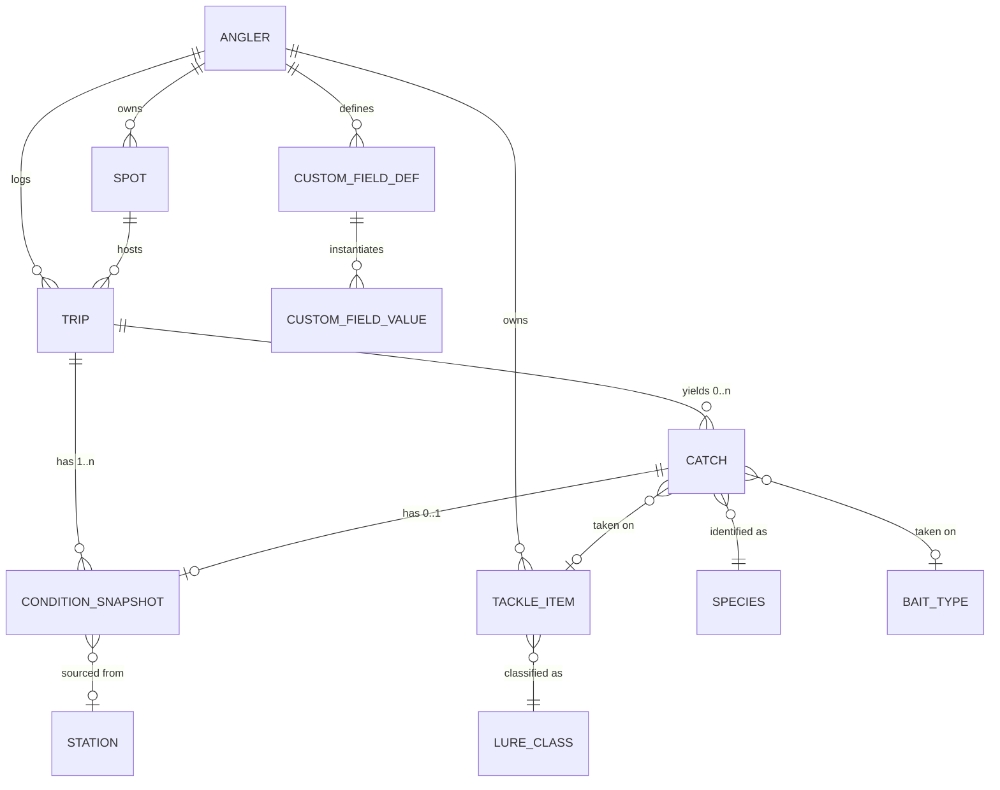

# Canonical Ontology

**Status:** draft for the domain-modeling session. Resolves O5, implements D11 and D13.
**Owner:** `architect`. Corrections to the vocabularies belong to the founder.
**Not** a migration. No code follows from this until the founder has walked the lists.

## How to read this

| Mark | Meaning |
|---|---|
| `AUTO` | Phone or API supplies it. The user never sees an empty box (D9). |
| `USER` | The user types or taps it. The data to auto-fill it does not exist. |
| `DERIV` | Computed from other stored fields. Never typed, never fetched. |
| `?` | **I am guessing at angler vocabulary here.** Founder must correct. |

`?` is not decoration. Where it appears I have invented a term or a boundary from
outside the sport and it is likely wrong.

## 1. The shape of the model

Six things hang together and the rest is vocabulary:

- **Trip is the unit of effort.** It is the denominator (D2). A Trip with zero Catches
  is not an empty record — it is the most valuable record in the database.
- **Catch always belongs to a Trip.** No orphans, ever. If a user one-taps a catch
  without having started a trip, the app opens an implicit Trip behind them. A Catch
  with a null `trip_id` would silently vanish from every rate calculation.
- **ConditionSnapshot is immutable and repeatable.** It is not a column set on Catch.
  A Trip gets one at start, one at end, and one per Catch. That is how "conditions when
  it happened" differs from "conditions when nothing happened" within the same trip.
- **Spot is a place; a Trip references it.** Coordinates on the Catch are the truth of
  where the fish came from; the Spot is the user's name for the neighbourhood.
- **Species, LureClass, BaitType, StructureType** etc. are global reference tables, not
  enums in code — rows get added without a deploy, and they carry `water_class` scoping.
- **CustomField\* is a separate, physically isolated island.** §5.

### Blank trips, and the honesty problem underneath them

There is no `is_blank` column. Blank is `count(catches) = 0`, `DERIV`, always — a
stored flag drifts the first time a catch is deleted. But R2 is real: a Trip with zero
catches might mean "caught nothing" or "the user stopped logging halfway through", and
those must not look the same to the analysis. So Trip carries:

- `ended_at` `USER` — nullable. Null means the trip was never closed out.
- `zero_catch_confirmed_at` `USER` — set only when the user answers "caught nothing"
  on the end-of-trip prompt.
- `catch_log_confidence` `USER` — `complete` / `partial` / `unknown`. Default `unknown`
  on an abandoned trip, `complete` when the trip was closed properly.

**Rule for the analysis layer:** only trips with `catch_log_confidence = 'complete'`
count toward a denominator. Everything else is logged, kept, and excluded from rates.
This is the difference between a real catch rate and a flattering one.

## 2. Core entities

### Angler
Thin wrapper over Supabase `auth.users`: unit preference (imperial/metric), home water
class, nothing else. No display name — there are no social features (spec §6), so there
is nobody to display it to.

### Spot
| field | mark | notes |
|---|---|---|
| `name` | USER | "The corner", "Second jetty". Private. Treat as sensitive text (§6). |
| `water_class` | USER | `salt` \| `fresh`. **This one field switches ontologies.** |
| `water_body_type` | USER | surf / pier / jetty / harbor / bay / open_coast / island / lake / reservoir / river / pond `?` |
| `lat`, `lng` | AUTO | From map tap (D4) or first catch. Precision policy in §6. |
| `geo_cell_1km`, `geo_cell_10km` | DERIV | Generated. The only geography that leaves the user's rows. |
| `tide_station_id` | DERIV | Nearest *reference* station, resolved once and pinned. |
| `weather_station_id`, `buoy_id` | DERIV | Same, with distance stored. |

Pinning the station on the Spot rather than resolving per-catch matters: a spot whose
station silently changes has an incoherent history.

### Trip
| field | mark | notes |
|---|---|---|
| `spot_id` | USER | Nullable — a boat trip may roam. Catches still carry coordinates. |
| `water_class` | DERIV | Denormalised from Spot. Every pooled query filters on it first. |
| `started_at`, `ended_at` | AUTO/USER | Start is auto on tap; end is user. Both UTC + IANA tz. |
| `platform` | USER | shore / surf / pier / jetty / kayak / private_boat / party_boat / float_tube / belly_boat `?` |
| `angler_count` | USER | Defaults 1. Effort scales with it. |
| `target_species_ids[]` | USER | What they went for, not what they got. Cheap, and it makes a blank trip interpretable. |
| `hours_fished` | DERIV | From start/end. Not typed. |
| `zero_catch_confirmed_at`, `catch_log_confidence` | USER | Above. |
| `notes` | USER | Free text. Never parsed for statistics. |

`platform` is the highest-value stratifier in the model and costs one tap. Surf catch
rates and party-boat catch rates are not the same population and must never be pooled.

### Catch
| field | mark | notes |
|---|---|---|
| `trip_id` | AUTO | Mandatory. |
| `caught_at` | AUTO | Device clock, UTC, plus captured IANA timezone. |
| `lat`, `lng`, `gps_accuracy_m` | AUTO | Correctable by map tap (D4). Store the accuracy — a 60 m fix is a different fact from a 4 m fix. |
| `species_id` | USER | Nullable. "Needs details" queue exists precisely so this can be filled later. |
| `outcome` | USER | `landed` \| `lost` \| `missed_bite` \| `short_bite` `?` — **include this.** A lost fish is a bite, and bites are the signal. If we omit it the user invents a custom field for it. |
| `disposition` | USER | `released` \| `kept` \| `n/a`. |
| `length_mm`, `weight_g` | USER | SI in the column, imperial at the glass. `size_estimated` boolean beside them. |
| `tackle_item_id` | USER | The user's own lure (§4). |
| `bait_type_id` | USER | Nullable, and orthogonal to lure — bait on a jighead is both. |
| `presentation` | USER | slow_roll / dead_stick / yo_yo / burn / bounce / drift / dropper_loop / fly_swing `?` |
| `depth_fished_m` | USER | Where the lure was, not where the bottom was. |
| `bottom_depth_m` | USER | Nullable. No API gives this at a useful resolution. |
| `structure_type_id`, `cover_type_id` | USER | §7. Both nullable, both settable. |
| `photo_id` | USER | V2. EXIF stripped on ingest (§6). |
| `notes` | USER | |

### ConditionSnapshot
One row per moment we care about. `kind` = `trip_start` \| `trip_end` \| `catch` \|
`manual` \| `interval`. Holds `trip_id NOT NULL` and `catch_id NULL` — a real foreign key
each way, no polymorphic column. Also denormalises `water_class` so that "tide is null
because this is a lake" and "tide is null because the fetch failed" are distinguishable.
Fields are grouped in §3. Two columns that must exist from day one:

- `enrichment_status` — `pending` \| `complete` \| `partial` \| `failed`. Offline logging
  (D3) means the snapshot is written before the APIs are reachable. This is not an edge
  case; it is the normal path.
- `provenance` jsonb, keyed by field name: `{source, station_id, distance_m, fetched_at}`.
  Biostat's rule 2. A water temp from 100 km away is a different fact from one at the
  pier and the UI has to be able to say which it has.
- `algo_version` int — which version of the tide/moon maths produced the `DERIV` fields.
  We will change that maths, and without this we cannot tell recomputed rows apart.

**Missing is null. Never zero.** (biostat rule 1.)

## 3. Two vocabularies, one engine (D13)

Divergence between salt and bass is **field nullability and vocabulary scope**, not
table structure. One `condition_snapshot` table serves both.

### Shared by both — the automatic set
| field | mark |
|---|---|
| `pressure_hpa`, `pressure_trend_3h_hpa` | AUTO — device barometer at log time, API backfill otherwise |
| `air_temp_c`, `wind_speed_ms`, `wind_dir_deg`, `cloud_cover_pct` | AUTO |
| `moon_phase_angle_deg` | AUTO — correlate on this, **not** illumination |
| `moon_illumination_fraction` | AUTO — display only |
| `days_from_full`, `days_from_new` | DERIV — **signed** |
| `moonrise_utc`, `moonset_utc`, `sunrise_utc`, `sunset_utc`, `civil_twilight_*` | AUTO |
| `minutes_from_sunrise`, `minutes_from_sunset` | DERIV — signed. Cheap, and probably one of the strongest predictors in the set |
| `day_of_year` | DERIV |

The 8-phase moon label is **never stored and never analysed on** — derived at render
time, for the icon only.

### Shared, but user-entered
| field | mark |
|---|---|
| `water_temp_c` | USER — D8, O3. Nearest buoy shown as a labelled reference beside an empty field. Never prefilled. |
| `surface_condition` | USER — glassy / ripple / light_chop / chop / whitecaps `?` |
| `bait_present` | USER — none / scattered / balls / heavy `?` Big signal in SoCal, one tap. |
| `bird_activity` | USER — none / scattered / working `?` |

### Salt only — null on a lake, and null *means* not applicable
| field | mark |
|---|---|
| `tide_height_m` | AUTO — NOAA CO-OPS 6-minute predictions |
| `tide_rate_m_per_hr` | AUTO — differenced series (O1). Signed: + flood, − ebb |
| `tide_state` | DERIV — `flood` \| `ebb` \| `slack` from the sign and magnitude of the rate |
| `tide_pct_through_cycle` | DERIV — 0–100 |
| `twelfths_hour` | DERIV — presentation over the real curve, never the maths underneath |
| `tide_range_m` | DERIV — the day's high minus low. "Big tide" lives here |
| `current_direction` | **USER** — D10, O2. uphill / downhill / inshore / offshore |
| `current_strength` | USER — none / light / moderate / ripping `?` |
| `swell_height_m`, `swell_period_s`, `swell_dir_deg` | AUTO where a buoy is in range, else null |

Never call `tide_rate_m_per_hr` "current" in schema, API, or copy (R7) — hence the
column name.

### Fresh/bass only — null on the coast
| field | mark |
|---|---|
| `water_clarity_id` | USER — §7 |
| `water_color_id` | USER — §7. Distinct from clarity: brown-and-clear is not green-and-clear |
| `visibility_cm` | USER — optional numeric beside the categorical |
| `water_level_trend` | USER — rising / stable / falling `?` (auto only for ~30 CA waters, per biostat §6) |
| `lake_elevation_m` | AUTO where USGS covers the water, null otherwise |
| `seasonal_pattern_id` | USER — §7. The bass-angler frame that has no saltwater equivalent |

### The trap in the nullable approach

Nullable-everywhere makes "not applicable" and "we failed to fetch it" identical. Two
mitigations, both required: `water_class` is denormalised onto the snapshot so
not-applicable is derivable without a join (no `not_applicable` sentinel — a sentinel is
a value, and values get averaged by accident), and `enrichment_status` distinguishes
fetch failure from absence. Analysis always filters `water_class` first — no query
meaningfully pools a lake and an ocean, and the schema should make that awkward.

## 4. Tackle: the two-level move

The single most important structural idea for keeping data poolable. A user's lure is "Lucky Craft 110 in chartreuse shad, the one with the beat-up hooks".
That string is worthless across users. The *class* — jerkbait — is worth a lot.

- `tackle_item` — user-owned, free text, colour, size, whatever they want. Powers the
  favourite-lures list (V1) and their own filtering. **Not poolable.**
- `lure_class` — global controlled vocabulary. Every `tackle_item` must point at one.

The user names their lure once; every catch after that inherits a poolable class for
free. They never type a taxonomy and we never lose one. Same pattern applies wherever
users have idiosyncratic names for canonical things.

## 5. Custom fields (D11) and how exclusion is actually enforced

### Storage

`custom_field_definition`: `angler_id`, `key`, `label`, `data_type`
(`text`/`number`/`enum`/`boolean`/`datetime`), `unit`, `options` jsonb, `applies_to`
(`trip`/`catch`), `key_normalized`.

`custom_field_value`: `angler_id`, `definition_id`, `trip_id`/`catch_id`, and **typed
columns** — `value_text`, `value_num`, `value_bool`, `value_ts`. Not a single jsonb blob:
at 100k rows a user filtering "water clarity above 3" needs an index on `value_num`, and
you cannot index a jsonb field usefully across heterogeneous types.

### Exclusion is a permission, not a flag

A `poolable = false` boolean on a row is a note-to-self that some future query will
forget to check. Do it structurally instead:

- Custom field tables live in a **separate Postgres schema** (`private`), not `public`.
- The role that pooled/cross-user analysis runs as has **no `SELECT` grant** on that
  schema. It is not possible to write the offending join.
- RLS on the custom tables is `angler_id = auth.uid()`, default deny, as with everything
  user-owned.

The UI labels these fields "yours only — not used in comparisons" (D11 requires the
labelling), but the label is the explanation, not the mechanism.

### Promotion path

When many users independently invent the same field, it graduates.
- Detection reads **definition metadata only** — `label`, `key_normalized`, `data_type`,
  `unit`. Never values. A field named "the spot where Dave fell in" is metadata about a
  schema; the values under it are a person's fishing log. The counting job must be
  physically restricted to the definition table.
- Promotion is never automatic. It is an ADR plus a migration: add the canonical column
  or vocabulary table, then backfill.
- Backfilled values carry `provenance = 'promoted_custom'` and a
  `custom_field_promotion` mapping row. A one-user free-text-to-enum mapping is lossy
  and any pooled analysis must be able to exclude promoted rows on demand.
- The original custom values stay where they are. We do not delete a user's data because
  we found a better home for its shape.

**The real defence against R5 is not this mechanism** — it is §7 being right in the
first place. Every field a user has to invent is data we lose permanently.

## 6. Precision and privacy

Anglers do not share spots, and the schema should make leaking one hard rather than
merely impolite.
**Storage precision.** Five decimal places (~1.1 m) is what a map pin needs and is the
maximum useful. Store lat/lng at that rounding plus `gps_accuracy_m` alongside — six
decimals on a fix accurate to 40 m is false precision that later looks like a measurement.

**Two generated cells, and they are the only geography that leaves the user's own rows:**
`geo_cell_1km` (enrichment cache keys — stations and weather grids are coarser than that
anyway, so nothing is lost) and `geo_cell_10km` (the finest granularity any cross-user
aggregate may ever group by).

**Places the schema would leak, in rough order of how much it would hurt:**

1. **Photo EXIF.** A shared photo carries exact coordinates. Strip GPS on ingest, before
   the file lands in storage. The photo is a worse leak than the coordinate column
   because photos get sent to friends.
2. **`tide_station_id` and `buoy_id` on a shared or pooled row.** A subordinate tide
   station with one pier next to it identifies the pier. Treat station IDs as
   location-bearing; they do not belong in any cross-user output.
3. **Spot names in logs, analytics, and error reports.** "The corner" plus a user id is
   a disclosure. Never put user text in an exception message or a Sentry breadcrumb.
4. **Enrichment request logs.** The server calls NOAA with raw coordinates. Round to the
   1 km cell *before* the outbound call and before any logging of it.
5. **Small-group aggregates.** A pooled result over three users at one 10 km cell is a
   description of three specific people's fishing. Enforce a minimum group size before
   any pooled figure renders — that threshold is O4's problem and it is a privacy
   constraint as much as a statistical one.
6. **Export.** Any CSV/GPX export must ask, explicitly, whether to include coordinates,
   and default to no.

Every user-owned table gets RLS keyed on `angler_id = auth.uid()`, default deny. There is
no "public catch" state in V1 because there is no sharing feature — do not add the
column speculatively.

## 7. Controlled vocabularies — the starting lists

Drafts for the founder to red-pen, deliberately short. Every `?` is a place I guessed.

### SoCal saltwater species

Stored with `common_name`, `scientific_name`, `aliases[]`, `is_group`, `water_class`.

**Groups** — most anglers log the group, not the species, so `is_group = true` entries
are first-class and specific species roll up to them:
Rockfish `?` (vermilion, copper, olive, gopher…), Surfperch `?`, Croaker `?`

**Inshore / surf / bay:** California halibut · Barred sand bass · Spotted sand bass ·
Kelp bass (calico) · California corbina · Barred surfperch · Walleye surfperch ·
Yellowfin croaker · Spotfin croaker · White croaker (tomcod) · Queenfish ·
Sargo `?` · Opaleye · Halfmoon · Jacksmelt `?` · Round stingray · Shovelnose guitarfish ·
Leopard shark · Bat ray · Horn shark `?`

**Nearshore / reef:** California sheephead · California scorpionfish (sculpin) ·
Lingcod · Cabezon `?` · Pacific sanddab `?` · Garibaldi (protected, no-take — logged
because it gets caught, flagged `take_status = protected`)

**Pelagic / offshore:** Yellowtail · White seabass · Pacific bonito · Pacific barracuda ·
Pacific mackerel · Jack mackerel `?` · Bluefin tuna · Yellowfin tuna · Dorado `?` ·
Thresher shark `?`

*Least confident:* whether to split or roll up rockfish and surfperch; whether the
offshore tuna set belongs in V1 at all given D7's inshore focus; local common names
(is it "sculpin" or "scorpionfish" in the log?).

### Lure classes
swimbait (soft plastic) · plastic grub · plastic worm · jerkbait (hard) ·
crankbait · topwater walker · popper · surface iron `?` · yo-yo iron `?` ·
lead-head jig · bucktail jig · spoon · sabiki · fly · trolled plug `?` · spinnerbait ·
Carolina rig `?` · dropper loop rig `?`

*Least confident:* whether "surface iron" and "yo-yo iron" are lure classes or
presentations — locally they seem to be both an object and a way of fishing it. Same
doubt for rigs (Carolina, dropper loop): here, or in `presentation`? Allowing both would
fragment the data. This is the kind of distinction a fisherman settles in one sentence.

### Bait types
live anchovy · live sardine · live squid · live mackerel · dead/frozen squid ·
frozen anchovy · sand crab · ghost shrimp · market shrimp · mussel · bloodworm `?` ·
lugworm `?` · cut bait · salted anchovy `?` · grunion `?`

### Structure types
*Bottom geometry — where the fish is, not what it is hiding in.*

**Salt:** sand flat · eelgrass bed · sand/eelgrass edge · reef · rocky point · kelp edge ·
inside kelp `?` · jetty · pier pilings · breakwall · harbour dock · channel edge ·
drop-off · surf trough · rip · sandbar · river mouth · wreck/artificial reef ·
boiler rock `?`

**Fresh/bass:** main-lake point · secondary point · creek channel · ledge · rock pile ·
hump · bluff wall · flat · dam face · riprap · submerged roadbed `?` · drop-off ·
spawning flat

### Cover types (fresh, mostly)
laydown · standing timber · brush pile · tule `?` · reeds · grass/hydrilla `?` ·
lily pads · dock · overhanging tree · rock

*Structure vs cover is a distinction bass anglers make and saltwater anglers mostly do
not.* Kept as two fields, both nullable, both settable on one catch. Founder to confirm
the separation earns its keep rather than just annoying people.

### Water clarity  /  water colour
**Clarity:** gin clear · clear · lightly stained · stained · muddy `?`
**Colour:** blue · green · green-brown · brown · tannic/tea `?` · algae bloom `?`
**Salt-specific:** red tide — colour, clarity, or its own flag? It matters enough in
SoCal to deserve a decision.

### Seasonal pattern (bass only)
prespawn · spawn · postspawn · summer · fall transition `?` · winter

### Fixed vocabularies I am confident about
- `tide_state`: flood · ebb · slack (DERIV)
- `current_direction`: uphill · downhill · inshore · offshore (D10, USER)
- `disposition`: kept · released
- `water_class`: salt · fresh

## 8. The question I most need answered

**What do "uphill" and "downhill" actually mean?** (D10.)

Three readings, and I do not know which is the founder's: (a) up-coast versus down-coast
— northwest toward Huntington and Long Beach versus southeast toward Laguna and Dana
Point; (b) the current running with or against the prevailing swell; (c) water moving
toward or away from the structure the angler is standing on. Encode the wrong one and
every catch logged before the correction is mislabelled and unfixable — nobody remembers
which way the water ran six months ago. One sentence from the founder unblocks it, and
nothing else here is as urgent.

Cheaper questions for the same session: is a lost fish worth logging (§2, Catch
`outcome`)? Do surf anglers think in "structure" at all, or is that a bass word?
