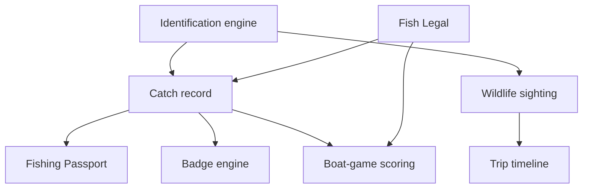

# Fish Passport, Wildlife ID, and Boat Games

**Product:** Fish Log Book
**Document type:** Product and implementation specification
**Status:** Proposed — ready for technical planning
**Version:** 1.0
**Date:** 2026-09-03

> Founder-supplied source of truth, captured verbatim in substance. Nothing here is
> built yet. Phase 1 (§36) is the only slice cleared for implementation planning.

---

## 1. Executive summary

This initiative expands Fish Log Book from a private catch journal into a connected
collection, discovery, and on-the-water social experience.

The initiative has four related feature families:

1. **Fishing Passport and My Species** — automatically turn catch history into a visual
   collection of species, regions, personal records, and progress.
2. **Badges and verification** — reward exploration, skill, consistency, responsible
   releases, and verified accomplishments without requiring a photo for ordinary use.
3. **Marine Wildlife and Fin ID** — identify and log whales, marine mammals, sharks,
   rays, and other wildlife as sightings rather than catches.
4. **Boat Games** — let anglers on the same boat run friendly, offline-capable games
   scored from their catch logs.

The first implementation slice is intentionally limited to My Species, Fishing Passport,
and a small foundational badge catalog. Photo verification, wildlife logging, and
multiplayer games build on that foundation in later phases.

The existing catch record remains the source of truth. Do not create a second catch
system, duplicate a catch when awarding progress, or make the normal catch flow slower.

## 2. Product objective

Create a compelling reason for anglers to return after each trip by showing what they
have discovered, what they have accomplished, and what they could pursue next.

The feature must preserve the core Fish Log Book value proposition:

> Every catch is a snapshot in time: species, time, GPS, spot, rod and rig, bait,
> conditions, tide, environment, legal context, and media.

Passport, badges, identification, and games consume that snapshot. They must not fork
or weaken it.

## 3. Success criteria

The initiative succeeds when:

- Existing users immediately see a species collection built from their prior catches.
- Logging a new species produces a satisfying but brief progress moment.
- A user can distinguish personal, photo-supported, and human-verified accomplishments.
- Wildlife sightings live on the same trip timeline without being described as catches.
- A group can run a boat game without dependable cell service.
- Every scored catch still respects Fish Legal, bag-limit, boundary, and protected-species
  safeguards.
- The system never encourages illegal retention, wildlife harassment, or excessive
  harvesting for points.

## 4. Product principles

### 4.1 Preserve fast logging

The current species-first, local-first catch flow is the primary workflow. Passport and
badge evaluation happen after save and must not add required fields to ordinary catch
logging.

### 4.2 One record, many uses

A catch may contribute to personal analytics, passport progress, badges, and a game, but
it remains one catch record with one stable ID.

### 4.3 Personal progress is inclusive

A self-reported catch counts toward a user's private passport. Stronger proof is only
required for verified badges, public competitions, records, or prizes.

### 4.4 Verification must be understandable

AI identification confidence is not proof. Photo evidence, GPS evidence, captain
approval, community review, and tournament verification are separate facts and must be
displayed separately.

### 4.5 Legal and ethical behavior comes before engagement

No points or badges may reward exceeding limits, retaining prohibited fish, targeting
protected wildlife, approaching marine mammals, or publishing sensitive wildlife
locations.

### 4.6 Offline is a primary state

Passport viewing, badge progress, wildlife drafts, and active boat games must remain
useful offshore. The UI must identify pending synchronization without blocking the user.

### 4.7 Region-aware, not California-specific

Collections and identification use the shared species ontology and selected fishing
region. The implementation must support saltwater, freshwater, all U.S. coastal regions,
Mexico, and later international packs without hard-coded California logic.

## 5. System relationship



Passport, badges, and scores are projections of source records. They do not own or
silently rewrite catches.

## 6. Scope and phased delivery

| Phase | Scope | Priority |
|---|---|---|
| 1 | My Species, Fishing Passport, personal records, starter badges | Build first |
| 2 | Photo evidence, verification levels, AI-assisted ID boundary | Next |
| 3 | Wildlife sightings, whale/marine-mammal ID, reusable Fin ID | Later |
| 4 | Private Boat Battles with offline-capable game sessions | Later |
| 5 | Clubs, public challenges, leaderboards, moderation, tournament verification | Future |

Do not combine all phases into one pull request. Each phase must be independently
shippable behind a feature flag.

---

# Part I — Fishing Passport and My Species

## 7. User stories

- As an angler, I can see every species I have logged in one place.
- As an angler, I can see species I have not caught without being shown sensitive or
  inappropriate targets.
- As an angler, I can filter my collection by region, water type, species family,
  verification status, and caught/uncaught status.
- As an angler, I can open a species to see my first catch, most recent catch, personal
  best, total catches, releases, retained catches, and photos.
- As an angler, I can see progress toward regional and family-based collections.
- As an angler, I receive a small celebration when I log a new species or unlock a badge,
  without interrupting the next action.
- As an angler with old catch records, I receive credit automatically without manually
  rebuilding my history.

## 8. Information architecture

### 8.1 Proposed routes

- `/passport` — passport overview and collections.
- `/passport/species` — full My Species grid.
- `/passport/species/[speciesId]` — personal species detail.
- `/passport/badges` — earned badges and progress.
- `/passport/collections/[collectionId]` — regional or family collection detail.

Do not add another permanent primary-navigation item during Phase 1. The existing mobile
navigation already has limited space. Enter Passport from the profile/account area, a
dashboard collection card, and post-catch progress. A later navigation review may promote
it based on usage.

### 8.2 Passport overview

The overview must include:

- Total unique species caught.
- Verified unique species count.
- Total catches, releases, and retained catches.
- Latest new species.
- Current region collection progress.
- Recently earned badges.
- Three nearest-to-completion goals.
- Link to the complete My Species grid.

Avoid a feed of generic achievements. Every card should lead to a meaningful species,
collection, catch, or badge detail page.

## 9. My Species grid

Each species card contains:

- Species common name.
- Local or alternate name when available.
- Licensed/approved species image or existing bundled illustration.
- Caught or uncaught state.
- Verification indicator when applicable.
- Total catch count.
- Personal-best measurement when available.
- First-caught date.

Uncaught species use a silhouette or restrained treatment. Do not imply the user should
target a protected, prohibited, threatened, or sensitive species. Such species can be
shown for education but must be labeled appropriately and excluded from completion
requirements.

### 9.1 Filters and sorting

Required filters:

- Caught / uncaught / all.
- Current fishing region / all regions.
- Saltwater / freshwater / brackish when ontology supports it.
- Species family or category.
- Any verification / photo-supported / human-verified.

Required sorting:

- Recently caught.
- First caught.
- Most caught.
- Name A–Z.
- Personal-best size when comparable.

### 9.2 Species detail

The personal species page shows:

- Species identity and educational summary.
- Total caught, retained, and released.
- First and most recent catch.
- Personal best by length and weight, kept as distinct records.
- Catch history list and map access.
- Photo gallery.
- Most-used rod/setup and bait when enough data exists.
- Conditions/tide summary only when sample size is sufficient.
- Applicable passport collections.
- Fish Legal entry point for the selected region.

Do not present a correlation from a single catch as a pattern. Existing analytics
sample-size rules apply.

## 10. Counting rules

The catch table is authoritative. Adapt the names below to the repository's existing
schema rather than creating parallel concepts.

A catch counts toward the private passport when:

- It belongs to the current user.
- It is not deleted or invalidated.
- It has a recognized species ontology ID.
- Its disposition is a valid application value.

Additional rules:

- Multiple catches of one species increase catch count but add only one unique species.
- Editing a catch from species A to species B recalculates both species.
- Deleting the only catch of a species removes current caught status.
- Historical achievements retain an audit trail but may become revoked if their only
  qualifying source is removed or invalidated.
- Quick Mark completion updates the original record and must not create double credit.
- Manually entered historical catches count and are labeled as manual when relevant.
- Group-only ontology entries such as generic rockfish may appear in history but do not
  satisfy an individual-species collection until identified more precisely.

## 11. Collections

A collection is a versioned definition containing eligible species and completion rules.
Initial collection types:

- **Geographic:** Southern California, Northern California, Pacific Northwest, Gulf Coast,
  Atlantic Coast, Hawaii, Alaska, Mexico, and later state-specific passports.
- **Habitat:** freshwater, inshore, offshore, pelagic, reef, surf, and deepwater.
- **Family/category:** bass, tuna, rockfish, sharks and rays, salmon and trout, flatfish,
  crustaceans, and other curated groups.
- **Experience:** night fishing, shore fishing, kayak fishing, and boat fishing when
  source catch fields support those claims.

Collection membership must be data-driven and versioned. Do not hard-code species lists
inside React components.

Protected or prohibited species must never be required for 100% completion. If they are
shown educationally, mark them `informational_only`.

## 12. Phase 1 badge catalog

Ship a small catalog that is easy to understand and test:

| Badge | Requirement |
|---|---|
| First Catch | Log one valid catch |
| Species Explorer I | Catch 5 unique species |
| Species Explorer II | Catch 10 unique species |
| Species Explorer III | Catch 25 unique species |
| Freshwater Explorer | Catch 5 eligible freshwater species |
| Saltwater Explorer | Catch 10 eligible saltwater species |
| Responsible Release I | Log 10 released fish |
| New Waters I | Log valid catches in 3 eligible fishing regions |
| Night Bite | Log a valid catch during local nighttime using recorded time and location |
| Photo Journal I | Attach evidence photos to 10 distinct catches |

Do not ship streak badges in Phase 1. Streak pressure is a poor fit for weather-dependent
outdoor activity and may encourage unnecessary trips or low-quality logs.

## 13. Badge engine requirements

- Badge definitions are data, not component conditionals.
- Evaluation is deterministic and idempotent.
- The same catch event cannot award the same badge twice.
- Progress recalculates after catch edit, deletion, verification change, and sync merge.
- Store the rule version used for an award.
- Store qualifying source IDs for auditability when reasonable.
- An award can be active, revoked, or superseded.
- Client-side evaluation may provide immediate feedback offline, but the server performs
  authoritative reconciliation after synchronization.
- No badge may depend on an unverifiable legal conclusion from AI.

## 14. Celebration behavior

After a catch saves:

- Show at most one compact progress message immediately.
- Prioritize "New species" over a routine count update.
- Queue multiple badge unlocks in an inbox or summary rather than stacking modals.
- Never block the user's ability to log another fish.
- Respect reduced-motion settings.
- Provide text and icon changes in addition to color.

---

# Part II — Evidence, Identification, and Verification

## 15. Verification model

Verification is composed from evidence. Do not use one ambiguous `verified: boolean`.

| Level | Display label | Minimum evidence |
|---|---|---|
| 0 | Self logged | User-created catch record |
| 1 | Photo supported | Original media attached to the catch |
| 2 | Metadata supported | Photo plus compatible time/location metadata or in-app capture |
| 3 | Human verified | Captain, approved reviewer, or defined community process confirms it |
| 4 | Event verified | Tournament/event rules and reviewer approval satisfied |

AI identification is stored separately:

- Suggested species IDs and ranked alternatives.
- Model/provider version.
- Confidence score.
- Input media ID.
- User-confirmed species.
- Human-review result when applicable.

The UI may say "Likely California yellowtail — 87% confidence." It must not say the catch
is verified solely because the model is confident.

## 16. Photo policy

- A photo is optional for an ordinary private catch and basic passport credit.
- A photo is required for photo-supported badges and may be required by private game or
  event rules.
- Original media should remain associated with the catch's stable ID.
- EXIF absence is not proof of fraud; many apps and devices strip metadata.
- EXIF presence is supporting evidence, not absolute proof.
- Uploaded images require size limits, safe content handling, and moderation/reporting
  before public social features launch.
- Public views must not expose precise private fishing coordinates through EXIF.

## 17. Reusable Fin ID engine

"Fin ID" is a reusable identification layer, not a separate engine for every animal.

Supported observation traits may include:

- Body shape and approximate size.
- Dorsal, pectoral, pelvic, anal, and tail-fin shape or placement.
- Tail/fluke shape.
- Mouth position and tooth visibility.
- Color, spots, bars, bands, and countershading.
- Number of visible dorsal fins.
- Fin clips, scars, or distinguishing marks.
- Saltwater/freshwater context.
- Geographic range and season.
- Observed behavior.

The engine returns ranked candidates, distinguishing traits, missing questions, and
confidence. Location may narrow candidates but must not override contradictory visual
traits.

The existing rockfish identifier should eventually use this shared structure rather than
become an isolated one-off wizard.

---

# Part III — Marine Wildlife Log

## 18. Wildlife scope

Wildlife observations are sightings, never catches. Initial categories:

- Whales.
- Dolphins and porpoises.
- Seals and sea lions.
- Sea turtles.
- Sharks and rays observed but not caught.
- Seabirds.
- Other notable marine wildlife.

## 19. Wildlife sighting flow

Proposed entry: the existing quick-add/log menu gains **Log Wildlife Sighting**.

The flow captures:

- Species, ranked suggestion, or unknown.
- Photo/video when available.
- Date and time.
- GPS location and accuracy.
- Estimated count or range.
- Behavior: traveling, feeding, breaching, resting, socializing, distressed, or other.
- Direction of travel.
- Observation platform: boat, kayak, shore, pier, or other.
- Distance band rather than falsely precise distance.
- Notes.
- Trip association.
- Sync state and identification state.

A saved sighting appears on the trip timeline and private map using an icon distinct from
catch markers.

## 20. Whale identification levels

### 20.1 Phase 3 target: species identification

Use range, body size, blow shape, dorsal-fin position, coloration, fluke behavior, and
photographs to suggest whale species.

### 20.2 Future research feature: individual matching

Matching a particular whale from fluke patterns, dorsal fins, scars, and catalogs is a
separate research-grade feature. Do not promise individual identity in Phase 3. Pursue it
later through an appropriate scientific database or conservation partnership.

## 21. Wildlife safety and privacy

- Never award points for close approach, pursuit, touching, feeding, or repeated
  disturbance.
- Show concise viewing-distance and non-harassment guidance appropriate to the region.
- Exact sighting coordinates are private by default.
- Public sharing uses coarse location, delayed location, or no location for sensitive
  species.
- The system may invite users to report distressed or entangled animals through an
  official regional resource, but must not instruct untrained intervention.
- Threatened, endangered, and protected species are excluded from competitive target lists
  and catch-style language.

---

# Part IV — Boat Games

## 22. Product concept

A Boat Battle is a private game session associated with a fishing trip. One user is the
host. Other anglers join using a short code or QR code. Eligible catches flow into the
game after save and are scored from an immutable game snapshot.

"Squid Game" must not be used as a product or mode name. Use **Last Angler Standing** to
avoid confusion with an existing entertainment property.

## 23. Core multiplayer flow

1. Host creates or opens a trip.
2. Host selects Start Boat Battle.
3. Host selects a game template, duration, players/teams, target species, scoring, and
   verification rule.
4. The app validates targets against Fish Legal and protected-species restrictions.
5. Players join by QR code, short code, or local invitation.
6. Players log catches through the ordinary catch flow.
7. Eligible catches become pending or accepted game events.
8. The host resolves disputes or identification uncertainty.
9. The game ends automatically or by the configured rule.
10. A final scoreboard and trip recap are saved.

No cash wagering, betting, or platform-facilitated gambling is in scope.

## 24. Offline behavior

- The host device maintains the authoritative local session while offline.
- Each event has a stable UUID, device ID, local timestamp, server timestamp when
  available, catch ID, and idempotency key.
- Joined devices retain a local copy of rules and their submitted events.
- The UI clearly labels unconfirmed scores while devices cannot synchronize.
- Reconnection merges events deterministically and surfaces conflicts to the host.
- Never award a catch twice after retry or reconnect.
- Do not rely on continuous WebSockets as the only game path.

Peer-to-peer transport may be explored later. Phase 4 may begin with same-device host
entry plus delayed cloud synchronization if reliable local networking is not available.

## 25. Initial game modes

### 25.1 Species Cricket

Inspired by darts cricket:

- The host selects eligible target species.
- Each target requires a configurable number of marks; default is three.
- Catching a target adds one mark unless the host enables size-based marks.
- After a player closes a species, additional eligible catches score points until every
  opponent closes that species.
- Highest score after all targets close or time expires wins.

### 25.2 Fishing Bingo

The host selects or generates a card containing legal and safe objectives, such as:

- Catch a bass-family species.
- Catch using live bait.
- Catch during an incoming tide.
- Catch three different species.
- Properly release a legal target species.
- Record catches on two different active setups.
- Log a wildlife sighting from a safe distance.

Wildlife squares reward observation, not proximity.

### 25.3 Captain's Cup

The host assigns points to eligible species or categories. Optional bonuses may include:

- First eligible catch.
- New personal species.
- Personal-best legal catch.
- Properly documented release.
- Species diversity.

### 25.4 Species Sprint

The player or team with the most unique eligible species during the time window wins. This
mode favors variety rather than harvesting volume.

### 25.5 Grand Slam

The host defines three to five legal target species. Completing the set wins, with time or
points used as the tiebreaker.

### 25.6 Last Angler Standing

- The game uses fixed rounds, such as 30 or 60 minutes.
- At each round boundary, the lowest eligible score is eliminated.
- Eliminated players may keep logging catches, but those catches no longer change the
  primary competition.
- Tie handling is configured before the game begins.

## 26. Scoring safeguards

- Species points are configured by a host/template, not automatically inferred from
  ecological rarity.
- A protected, prohibited, illegally retained, or invalid catch receives zero points and
  is flagged for review.
- Fish Legal warnings remain visible inside the game flow.
- A legal released catch may score the same as a retained catch.
- Games must not reward cumulative retention beyond applicable limits.
- Length/weight bonuses apply only where measurement is appropriate and the catch is
  eligible.
- Rule snapshots are frozen at game start so every player sees the same scoring rules.
- The game snapshot does not override current law. A new Fish Legal warning can still
  invalidate retention or scoring.
- Host edits and adjudications require an audit entry.

## 27. Game verification options

Per-session options:

- Honor system.
- Photo required.
- Host approval required.
- Photo plus host approval.
- Event/tournament verification, reserved for Phase 5.

Casual games default to the honor system. Requiring photos for every private family or
boat game would slow logging unnecessarily.

---

# Part V — Data and Technical Design

## 28. Source-of-truth policy

- Existing catch records remain authoritative for catch facts.
- Existing species ontology remains authoritative for species identity.
- Fish Legal remains authoritative for bundled legal guidance and regulation snapshots.
- Passport summaries are derived projections.
- Badge awards are persisted audit records backed by deterministic evaluation.
- Game events reference catches; they do not copy an editable duplicate of a catch.
- Wildlife sightings use a separate event type/table because they are not catches.

## 29. Logical data model

Names are conceptual. The implementation agent must inspect and follow existing table, ID,
timestamp, RLS, and migration conventions.

### 29.1 `passport_collections`

- `id`
- `slug`
- `name`
- `description`
- `collection_type`
- `region_id` nullable
- `version`
- `active`
- `published_at`

### 29.2 `passport_collection_species`

- `collection_id`
- `species_id`
- `required`
- `informational_only`
- `sort_order`

### 29.3 `badge_definitions`

- `id`
- `slug`
- `name`
- `description`
- `category`
- `tier`
- `rule_type`
- `rule_config` JSON
- `rule_version`
- `icon_key`
- `active`
- `published_at`

### 29.4 `user_badge_awards`

- `id`
- `user_id`
- `badge_definition_id`
- `rule_version`
- `status`: active, revoked, or superseded
- `progress_snapshot` JSON
- `qualifying_source_ids` JSON or normalized join, based on scale
- `awarded_at`
- `revoked_at` nullable
- `created_offline_id` nullable

Unique active-award constraints must prevent duplicate awards.

### 29.5 `catch_verifications`

- `id`
- `catch_id`
- `verification_type`
- `status`
- `reviewer_user_id` nullable
- `evidence_media_ids`
- `reason_code` nullable
- `notes` nullable
- `created_at`
- `resolved_at` nullable

### 29.6 `identification_suggestions`

- `id`
- `subject_type`: catch or wildlife_sighting
- `subject_id`
- `media_id`
- `candidate_species` JSON
- `model_name`
- `model_version`
- `created_at`
- `user_selected_species_id` nullable
- `human_review_status` nullable

### 29.7 `wildlife_sightings`

- `id`
- `user_id`
- `trip_id` nullable
- `species_id` nullable
- `identification_state`
- `observed_at`
- `latitude` and `longitude`, following existing privacy/storage policy
- `location_accuracy_m` nullable
- `count_min` nullable
- `count_max` nullable
- `behavior_codes`
- `direction_of_travel` nullable
- `platform`
- `distance_band` nullable
- `notes` nullable
- `sensitivity_level`
- `sync_state` local concern where appropriate
- `created_at`, `updated_at`, and deletion/audit fields per project convention

### 29.8 `game_sessions`

- `id`
- `trip_id`
- `host_user_id`
- `mode`
- `status`: draft, lobby, active, paused, completed, or cancelled
- `join_code_hash`
- `rules_snapshot` JSON
- `legal_context_snapshot` JSON
- `starts_at`, `ends_at`
- `created_at`, `updated_at`

### 29.9 `game_participants`

- `id`
- `game_session_id`
- `user_id` nullable for temporary guest
- `display_name`
- `team_id` nullable
- `role`
- `joined_at`
- `eliminated_at` nullable

### 29.10 `game_events`

- `id`
- `game_session_id`
- `participant_id`
- `catch_id` nullable
- `event_type`
- `round_number` nullable
- `points_delta`
- `eligibility_status`
- `verification_status`
- `reason_codes`
- `idempotency_key`
- `client_created_at`
- `server_received_at` nullable
- `adjudicated_by` nullable

Derive leaderboards from immutable events. If a cache is added later, it must be
rebuildable.

## 30. RLS and authorization

- Users can read and edit their own private passport inputs.
- Passport projections expose only data the catch owner may access.
- A game participant can read the session information required to play.
- Only the host or explicitly assigned adjudicator can approve disputed game events.
- A participant cannot alter another participant's catch.
- Human verification actions identify the reviewer and create an audit trail.
- Exact wildlife and catch coordinates remain protected by existing privacy rules.
- Public profiles, leaderboards, and community review are out of scope until moderation,
  blocking, reporting, and privacy controls exist.

## 31. Offline and synchronization rules

- Use stable client-generated UUIDs for offline-created records.
- Every mutation has an idempotency key.
- Passport progress can be computed locally from available catches.
- Server reconciliation is authoritative after sync.
- A pending catch may show provisional progress.
- Sync rejection removes provisional credit with a plain-language explanation.
- Conflicting catch edits follow the project's existing conflict policy.
- Game scoring must retain both the submitted event and adjudication history.

## 32. Proposed module boundaries

Follow existing repository conventions after inspection. Suggested boundaries:

```text
src/core/passport/          Pure collection and progress rules
src/core/achievements/      Deterministic badge evaluation
src/core/identification/    Trait scoring and candidate ranking
src/core/games/             Pure scoring and game state transitions
src/features/passport/      Passport UI and application services
src/features/achievements/  Badge UI and notifications
src/features/wildlife/      Wildlife log and sighting UI
src/features/boat-games/    Lobby, scoreboard, and game controls
src/app/passport/           App Router pages
```

Core rules require vector tests and must not import React, browser-only APIs, or database
clients.

## 33. Accessibility and mobile UX

- Design for 320-pixel-wide screens and one-handed use.
- Minimum tap targets follow the existing design system.
- Status uses words/icons in addition to color.
- Respect reduced motion and device text scaling.
- Do not stack celebration dialogs.
- Scoreboards announce meaningful changes without continuous noisy screen-reader output.
- Forms preserve drafts when the app backgrounds or loses service.
- Maps and photos have useful text alternatives.

## 34. Analytics and product measurement

Capture privacy-conscious product events for:

- Passport opened.
- Species detail opened.
- New species recorded.
- Collection progress reached.
- Badge awarded or revoked.
- Evidence photo attached.
- Wildlife sighting saved.
- Game created, joined, completed, or abandoned.
- Game mode selected.

Primary measures:

- Percentage of active catch loggers who open Passport.
- Return rate after a new-species or badge event.
- Average unique species per active user.
- Photo attachment rate without forced prompts.
- Completed private games per created game.
- Catch-log completion time before and after launch.

Do not optimize badge counts at the expense of accurate catch data.

---

# Part VI — Implementation Plan

## 35. Feature flags

- `passport_v1`
- `catch_verification`
- `wildlife_log`
- `fin_id`
- `boat_games`
- `public_achievements` reserved for future use

Flags must allow schema and rule deployment before broad UI exposure.

## 36. Phase 1 ticket breakdown

**Ticket 1 — Passport domain and selectors**

- Define collection, progress, species-summary, and badge types.
- Build pure selectors from existing catch and species data.
- Handle edits, deletions, generic species groups, manual catches, and Quick Mark records.
- Add vector tests.

**Ticket 2 — Collection definitions**

- Add versioned collection definitions and species membership.
- Seed a small region/category set using the existing ontology.
- Exclude protected/prohibited targets from required completion.
- Add validation for missing and duplicate species IDs.

**Ticket 3 — My Species page**

- Build caught/uncaught grid, filters, sorting, loading, empty, and offline states.
- Reuse licensed existing species artwork.
- Add accessible status labels.

**Ticket 4 — Personal species detail**

- Add first/latest catch, totals, release/retention counts, personal bests, gallery, and
  history access.
- Link to Fish Legal without presenting stale legal data as current.

**Ticket 5 — Starter badge engine**

- Add data-driven definitions for the Phase 1 catalog.
- Add idempotent local evaluation and server reconciliation.
- Add badge list/progress UI and compact post-catch celebration.

**Ticket 6 — Backfill and migration verification**

- Confirm existing catches produce correct passport state without duplicate records.
- Add migration/seed logic if persistence is required.
- Validate RLS and rollback behavior.

**Ticket 7 — Offline and sync hardening**

- Test provisional progress, retry, duplicate events, catch edits, and deletion.
- Confirm no duplicate awards after reconnect.

**Ticket 8 — Product QA and rollout**

- Validate 320-pixel screens, text scaling, reduced motion, dark/light/night modes, and
  offline behavior.
- Compare catch logging time before/after.
- Roll out behind `passport_v1`.

The first coding agent should implement or plan Tickets 1–5 only unless explicitly
assigned the remaining tickets. Use small branches and pull requests by concern.

## 37. Phase 1 acceptance criteria

- Existing valid catches populate My Species with no manual backfill by the user.
- A new valid species appears after catch save locally and after sync.
- Repeated catches increment totals but do not duplicate unique-species credit.
- Editing/deleting a qualifying catch recalculates progress correctly.
- Quick Mark resolution never produces double credit.
- Users can filter and sort the species grid as specified.
- Species detail displays first/latest catch, counts, personal bests, and available media.
- The Phase 1 badge catalog evaluates deterministically.
- Re-running evaluation produces no duplicate awards.
- Protected/prohibited species are not required for collection completion.
- Passport works with no network using locally available data.
- The catch flow gains no new required step.
- Existing region switching, Fish Legal, catch snapshots, calendar, map, tide, and setup
  behavior remain intact.
- Unit tests, type checks, lint, build, and relevant browser/mobile checks pass.

## 38. Later-phase acceptance highlights

**Verification**

- Self-logged, photo-supported, metadata-supported, human-verified, and event-verified
  states are distinguishable.
- AI confidence never silently changes verification status.
- Public output strips or protects private coordinates and EXIF.

**Wildlife**

- Sightings are separate from catches but can share a trip timeline.
- Unknown species can be saved and identified later.
- Sensitive locations remain private/coarsened.
- No engagement mechanic rewards wildlife approach.

**Boat Games**

- A host can create and finish a private game without dependable service.
- Retried events do not score twice.
- Illegal/ineligible catches score zero and remain auditable.
- Host adjudication is recorded.
- Fish Legal warnings remain available and cannot be overridden by game rules.

## 39. Test strategy

**Unit/vector tests**

- Unique-species counting.
- Catch edit/delete reconciliation.
- Generic versus identified species.
- Collection completion and informational-only exclusions.
- Badge threshold boundaries and idempotency.
- Verification-state composition.
- Every game-mode state transition and tiebreak rule.
- Duplicate/reordered offline game events.

**Integration tests**

- Existing catches to Passport projection.
- Catch save to progress notification.
- Offline catch to provisional progress to synchronized award.
- RLS across private profiles and game participants.
- Wildlife draft recovery and trip-timeline insertion.
- Game join, score, dispute, adjudication, and completion.

**End-to-end/mobile tests**

- First-time user with no catches.
- Existing user with years of catches.
- Manual historical catch.
- Quick Mark resolution.
- 320-pixel layout and text scaling.
- Airplane-mode passport and game flow.
- App background/restore during wildlife and catch logging.

## 40. Explicit product decisions

These decisions are locked for the initial implementation unless the founder changes them:

1. Self-logged catches count toward the private passport.
2. Photos are optional for ordinary catches and basic passport progress.
3. Verified/public accomplishments may require stronger evidence.
4. AI suggests identity but does not independently verify a catch or legal status.
5. Passport does not become a new primary-navigation tab in Phase 1.
6. Wildlife records are called sightings, not catches.
7. Exact wildlife locations are private by default.
8. Protected species never become competitive targets or required collection entries.
9. Boat Games are private and non-wagering in the initial release.
10. The commercial mode name is Last Angler Standing, not Squid Game.
11. The first implementation slice is Passport + My Species + starter badges.
12. Existing catch logging and Fish Legal behavior must be preserved.

## 41. Non-goals for the first release

- Public social network or global activity feed.
- Cash prizes, wagering, entry fees, or gambling mechanics.
- Global leaderboards.
- Automated tournament-grade fraud detection.
- Individual whale catalog matching.
- Scientific claims based only on crowdsourced sightings.
- Real-time peer-to-peer networking as a hard launch dependency.
- Requiring users to photograph every catch.
- Replacing Fish Legal or treating AI identification as legal advice.

## 42. Definition of done

A phase is complete only when:

- Scope-specific acceptance criteria pass.
- Data migrations and RLS are reviewed.
- Offline and synchronization behavior is tested.
- Accessibility and 320-pixel mobile layout are inspected.
- No existing catch, calendar, tide, map, setup, or Fish Legal workflow regresses.
- Unit tests, type checks, lint, and production build pass.
- The implementation is delivered in reviewable pull requests with what changed, why, and
  how it was verified.
- Any unimplemented portion remains explicitly documented rather than implied complete.

## 43. Recommended starting instruction for the implementation agent

> Implement Phase 1 of this specification only: the Passport domain/selectors, versioned
> collection definitions, My Species grid, personal species detail, and starter badge
> engine. Inspect and reuse the existing catch schema, species ontology, offline layer,
> design tokens, and repository conventions. Do not create a parallel catch table, do not
> add a new required catch-log step, and do not begin wildlife or multiplayer work in the
> same pull request. Break the work into the Phase 1 tickets, verify each concern, and
> preserve Fish Legal, region switching, Quick Mark, catch snapshots, calendar, tide, map,
> and setup behavior.

---

# Appendix — repository reality check (added by `coo`, 2026-09-03)

Everything above section 43 is the founder's document. This appendix is not: it is what
the repository actually contains today, checked against the spec's assumptions so an
implementing agent meets these facts in a document rather than halfway through Ticket 5.
Nothing here changes the spec. Three items need a founder or architect ruling before
Phase 1 code starts.

## 44. What Phase 1 can already build on

Checked in `src/core/rules/catch/types.ts` and
`supabase/migrations/20260828120000_v1_core_schema.sql`.

| Spec need | Exists today as |
|---|---|
| Unique-species counting (§10) | `catch.species_id` → `species.id` |
| Generic-group rule (§10, "generic rockfish") | `species.is_group` + `species.rolls_up_to` — the roll-up is already modeled |
| Protected/prohibited exclusion (§11) | `species.take_status` — `open` / `protected` / `regulated` |
| Saltwater/freshwater filter (§9.1) | `species.water_class` — `salt` / `fresh` / `both` |
| Kept vs released counts, Responsible Release I (§9.2, §12) | `catch.disposition` — `kept` / `released` / `n/a` |
| Personal bests by length and weight (§9.2) | `catch.length_mm`, `catch.weight_g`, with `catch.size_estimated` to qualify the claim |
| Quick Mark double-credit rule (§10, §37) | `catch.resolution_state` (`unresolved` / `confirmed` / `dismissed`) + `dismissed_reason` |
| Manual historical catches (§10) | `catch.capture_mode` — `live` / `backfill` |
| Night Bite badge (§12) | `catch.caught_at` + `caught_tz` + `lat`/`lng` |
| Soft-delete recalculation (§10) | `catch.deleted_at` on every table |
| Trip association for games and wildlife (§19, §29.8) | `trip` table with `trip.id` on every catch |
| Legal context snapshot for game scoring (§26) | `catch.regulation_snapshot`, frozen at log time |

The passport can therefore be computed as a pure projection over existing rows, exactly
as §28 requires. No second catch table is needed for Phase 1.

## 45. Three gaps that need a decision, not just code

### 45.1 There is no region on a catch — and that is deliberate

`src/core/ontology/regions.ts` states the current rule outright: *"no region is part of
the data model"*. Region is a device-local preference that decides which species chips
surface first; it never restricts search, never filters, and is never written to a catch.
That principle comes from ADR 007 §4 and the founder's own 2026-09-01 requirement #4
(`docs/product/requests/2026-09-01-expansion-requirements.md`).

This spec needs region in four places: the §9.1 region filter, the §8.2 "current region
collection progress" card, the §11 geographic collections, and the §12 **New Waters I**
badge ("valid catches in 3 eligible fishing regions"). None of them can read a field that
does not exist.

Three ways out, in the order I would prefer them:

1. **Derive region from `catch.lat`/`lng` at read time.** Keeps region out of the data
   model, which honors the existing decision. Costs a point-in-region test and needs an
   honest "region unknown" bucket, because `lat`/`lng` are nullable and shore/backfill
   catches often have neither.
2. **Snapshot the region preference onto the catch at log time**, the way
   `regulation_snapshot` and the gear labels already snapshot context. Cheap and exact,
   but it records where the angler *said* they fish, not where the fish was, and it does
   put region in the data model.
3. **Drop region from Phase 1.** Ship species, family, and habitat collections; defer
   geographic collections and New Waters I to Phase 2.

**Ruling needed from `architect`, with the founder's sign-off, because option 2 reverses
a stated principle.**

### 45.2 There is no media table, so nothing can hold a photo

The schema has no `media`, `photo`, or `attachment` table — the current tables are
`angler`, `trip`, `catch`, `catch_gear`, `spot`, `tackle_item`, `trip_rig`,
`trip_rig_gear`, `journal_entry`, `condition_snapshot`, the `reg_*` set, and the
vocabularies. `docs/product/ROADMAP.md` A2 still lists photos as an unaccepted V2
candidate.

That blocks, in Phase 1, the **Photo Journal I** badge (§12) and the species photo
gallery (§9.2); and in Phase 2, verification levels 1 and 2 entirely (§15), since both are
defined by attached media. Phase 3 wildlife photos and §17 Fin ID inherit the same gap.

Recommendation: cut **Photo Journal I** from the Phase 1 catalog and leave the gallery as
an empty state, rather than growing Phase 1 to include media capture, storage, EXIF
stripping (ROADMAP A2 is explicit that the privacy half matters), size limits, and offline
upload. Media is its own spec.

### 45.3 `species` has no family or category column

§9.1 requires a "species family or category" filter and §11 defines family collections
(bass, tuna, rockfish, sharks and rays, salmon and trout, flatfish, crustaceans). The
`species` table carries `is_group` and `rolls_up_to` — a roll-up, not a taxonomy.

Cheapest correct answer: express families as `passport_collections` rows of type
`family` (§29.1) and drive the filter from collection membership. That keeps the taxonomy
versioned and data-driven per §11, and adds no column to `species`.

## 46. This spec reverses part of ROADMAP Part 3

`docs/product/ROADMAP.md` Part 3 — "Deliberately NOT building" — currently rules out
badges and gamified logging, leaderboards, social feeds, and photo-based fish ID. That
section exists so the arguments are read before anyone re-proposes them, and this spec
re-proposes several. It is the founder's call to make and this document is the newer one,
so the spec stands; both files now carry the cross-reference.

The roadmap's substantive objection deserves a straight answer, because it is a good one:

> Gamification would bias the denominator — people log to protect a streak, and stop
> logging once it breaks. Our entire statistical claim rests on the log being an unbiased
> record of when someone fished. If any engagement mechanic is ever added, it must reward
> *confirming a trip honestly*, never reward catching or logging more.

This spec already answers most of it, and says so in its own words: §12 refuses streak
badges for the same reason the roadmap gives, §14 refuses to block or interrupt logging,
§26 refuses to reward retention, and §34 closes with "do not optimize badge counts at the
expense of accurate catch data".

What is left unanswered is narrower: **Species Explorer I–III and Species Sprint reward
catching more, which is the one thing the roadmap says an engagement mechanic must never
do.** `biostat` should say whether a unique-species count actually biases the effort
denominator the correlation engine depends on, or whether the bias is confined to
frequency-based mechanics such as streaks. That answer is worth having before the badge
catalog is finalized, not after anglers have a year of history under it.
